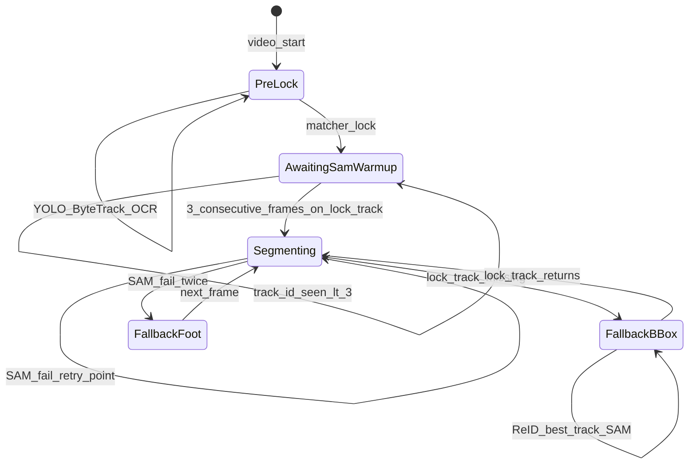

# MobileSAM segmentation throughout legacy pipeline

## Decisions captured (no guessing)

| Topic | Your choice |
|--------|-------------|
| Temporal | MobileSAM **every frame** (full FPS, `MAX_FRAMES` cap) |
| Model | **MobileSAM only** (lightweight; SAM2 out of scope) |
| Scope | **[backend/app/pipeline/run.py](backend/app/pipeline/run.py)** legacy path only |
| Start SAM | **3 consecutive frames after** `matcher.lock`, same `lock.track_id` |
| Pre-lock | No segmentation |
| Consumers | Foot for heatmap/movement, **RLE masks in API**, mask crops for **OCR + ReID** |
| Device | **Apple MPS** primary (`auto` → MPS → CPU) |
| Lock lost | **bbox_fallback**: best ReID match among tracks; **emit rows + heatmap** with `reid_fallback` flag |
| Track returns | **Resume SAM** when `lock.track_id` reappears |
| SAM fail | **One retry** with center-point-only prompt; then bbox foot + `mask_fallback` |
| Prompt | Box from ByteTrack bbox; retry = center point only |
| Foot | Lowest mask pixel; x = **median x of bottom 5%** of mask |
| Row schema | **Optional fields** on `Row` |
| Frontend | **Mask overlay** on legacy video player |
| Payload size | **v1: return all masks**; optimize later |
| MobileSAM source | **We pick** maintainable integration for existing `torch` stack |
| Env | `SAM_ENABLED=1` default on; graceful degrade if unavailable |
| Tests | **Unit only** (mocked SAM) |

---

## Architecture

**Per frame after SAM is active** (locked target only for inference):

1. Resolve **target bbox**: `lock.track_id` if in `tracks`, else best ReID cosine vs stored prototype (threshold via new env, e.g. `REID_FALLBACK_THRESH`, default align with `REID_LOCK_THRESHOLD` 0.65).
2. **MobileSAM**: bbox prompt → mask; on failure, center-point retry at bbox center.
3. **Foot** from mask ([`foot_from_mask`](backend/app/pipeline/segmentation.py) new); on failure use [`foot_position_pixels`](backend/app/pipeline/movement_stats.py) + `mask_fallback=true`.
4. **RLE** encode full-res mask (COCO-style or compact run-length on flattened bool; document format in schema).
5. **Rows**: append only for frames where we attribute to target (locked track or `reid_fallback`); keep existing behavior of filtering heatmap via [`_rows_for_heatmap`](backend/app/pipeline/run.py) but include fallback rows when `player` / flags indicate target attribution.
6. **OCR/ReID** on locked path: when `analyze` or locked-track processing runs **after SAM active**, crops from mask bounding rect (not full kit bbox).

---

## MobileSAM integration choice

Use the **official MobileSAM** encoder + SAM mask decoder via a thin wrapper in a new module (vendored minimal inference code or `git+https://github.com/ChaoningZhang/MobileSAM` dependency—prefer **pinned git tag** in [backend/requirements.txt](backend/requirements.txt) plus `mobile_sam.pt` weights under [backend/weights/](backend/weights/) or `SAM_WEIGHTS` env, mirroring [backend/app/pipeline/jersey_weights.py](backend/app/pipeline/jersey_weights.py)).

- Lazy singleton predictor (same pattern as [`get_reid_extractor`](backend/app/pipeline/reid.py)).
- Device: `SAM_DEVICE=auto|mps|cuda|cpu`; default `auto` tries MPS on Darwin.
- `SAM_ENABLED=0`: skip SAM; pipeline behaves as today (bbox foot, no `mask_rle`).

Document weight download in [backend/weights/README.md](backend/weights/README.md).

---

## Schema changes

Extend [`Row`](backend/app/schemas.py) with optional fields (all optional for backward compat):

| Field | Type | Purpose |
|--------|------|---------|
| `foot_x`, `foot_y` | `float` | Normalized foot (heatmap); if absent, derive from bbox |
| `mask_rle` | `str` \| `dict` | Full-res binary mask RLE (document counts/size) |
| `mask_fallback` | `bool` | SAM failed; foot from bbox |
| `segment_source` | `Literal["sam", "sam_retry", "bbox_fallback", "reid_fallback"]` | Provenance |
| `segment_track_id` | `int` | ByteTrack id used for SAM that frame |

Mirror in [src/types/analysis.ts](src/types/analysis.ts).

Optional: extend [`TargetMatch`](backend/app/schemas.py) with `segmentation_started_at_frame` for UI/debug.

---

## Pipeline changes ([run.py](backend/app/pipeline/run.py))

Introduce a small state object (e.g. `SegmentationState` in new [backend/app/pipeline/segmentation.py](backend/app/pipeline/segmentation.py)):

- `lock_frame`, `consecutive_on_lock_track`, `sam_active: bool`
- `reid_prototype` (reuse matcher’s prototype or refresh from first good mask crop)

**Hook points:**

1. After `matcher.try_acquire_lock()` sets lock → reset consecutive counter (do **not** SAM yet).
2. Each frame: if locked and `track_id == lock.track_id` → increment consecutive; when `>= 3` → `sam_active = True`.
3. If `sam_active` and `SAM_ENABLED`: run segmenter; populate row fields; use mask crop for `JerseyOCR` / `reid_extractor.embed` when processing that target bbox.
4. Pre-lock / non-target tracks: unchanged (no SAM).

**Row emission policy:** After lock, prefer emitting **target-attributed rows only** (locked + `reid_fallback`) to avoid bloating JSON with every player’s mask—confirm in implementation: today all mature tracks get rows; **narrow mask-bearing rows to target** while optionally keeping lightweight rows for others without `mask_rle` (document in README). *If you want zero behavior change for non-target rows, only attach `mask_rle` on target track rows.*

**Heatmap / movement:** Update [`trajectory_points_from_rows`](backend/app/pipeline/movement_stats.py) to use `foot_x`/`foot_y` denormalized to pixels when present, else `foot_position_pixels(bbox)`.

---

## Frontend overlay

1. Pass `result.rows` (or a `Map<frame, Row>`) into [LegacyVideoPanel](src/components/LegacyVideoPanel.tsx) / [VideoUploadPanel](src/components/VideoUploadPanel.tsx) after analyze.
2. Add `src/lib/maskRle.ts`: decode RLE → `ImageData` / `Path2D` for canvas.
3. Stack **canvas** over `<video>`; on `timeupdate`, pick row by `frame = round(currentTime * fps)`; draw semi-transparent fill.
4. Toggle “Show player mask” (default on when any `mask_rle` present)—small UX detail, not architecturally load-bearing.
5. Handle missing mask for frame (fallback period): no overlay or dim bbox.

---

## Performance expectations (set expectations, not blockers)

- Full FPS MobileSAM on up to **2000** frames on MPS: likely **minutes per clip**; acceptable per your choices.
- **Follow-up** (explicitly deferred): gzip response, mask downsampling, or sidecar artifact ([your `discuss_later`](user choice)).

---

## Environment variables (new)

| Variable | Default | Description |
|----------|---------|-------------|
| `SAM_ENABLED` | `1` | Master switch |
| `SAM_WEIGHTS` | `backend/weights/mobile_sam.pt` | Checkpoint path |
| `SAM_DEVICE` | `auto` | Inference device |
| `SAM_WARMUP_FRAMES` | `3` | Consecutive frames after lock before SAM |
| `REID_FALLBACK_THRESH` | `0.65` | Min cosine to use alternate track during loss |

---

## Testing ([backend/tests/](backend/tests/))

- `test_foot_from_mask.py`: synthetic mask → lowest point + bottom-5% median x.
- `test_mask_rle_roundtrip.py`: encode/decode random bitmap.
- `test_segmentation_state.py`: warmup counter, `sam_active` transitions (no torch).
- Mock `MobileSamSegmenter.segment` in a thin integration test for `run_pipeline` row flags (optional if too heavy).

No CI weights download per your choice.

---

## Files to touch (summary)

| Area | Files |
|------|--------|
| Core SAM | **new** [backend/app/pipeline/segmentation.py](backend/app/pipeline/segmentation.py), [backend/app/pipeline/mask_rle.py](backend/app/pipeline/mask_rle.py) |
| Pipeline | [backend/app/pipeline/run.py](backend/app/pipeline/run.py), [backend/app/pipeline/movement_stats.py](backend/app/pipeline/movement_stats.py) |
| Crops | [backend/app/pipeline/ocr.py](backend/app/pipeline/ocr.py) or helpers for mask-bounded crop |
| Schema | [backend/app/schemas.py](backend/app/schemas.py) |
| Deps/docs | [backend/requirements.txt](backend/requirements.txt), [backend/weights/README.md](backend/weights/README.md), [backend/README.md](backend/README.md) |
| Frontend | [src/types/analysis.ts](src/types/analysis.ts), [src/lib/maskRle.ts](src/lib/maskRle.ts), [VideoUploadPanel](src/components/VideoUploadPanel.tsx) / [Dashboard](src/components/Dashboard.tsx) |
| Tests | **new** `backend/tests/test_*` |

**Out of scope:** `detetction_test/`, `stv2_sandbox/`, SAM2, row bbox replacement (not selected).

---

## Risks to call out in implementation

1. **JSON size**: full-res RLE × 2000 frames may stress browser/network—monitor; follow-up optimization agreed.
2. **Wrong lock + 3 frames**: SAM still runs on wrong player—mitigation is future (stricter lock), not in this scope.
3. **Neighbor bleed** in bbox prompt: center-point retry may help; no negative-point prompts per your choice.
4. **Matcher stops OCR on other tracks after lock** ([backend/README.md](backend/README.md))—post-lock OCR on target uses mask crop only when your locked-track branch runs OCR; verify OCR schedule still runs on locked `track_id` every `OCR_EVERY` frames.
