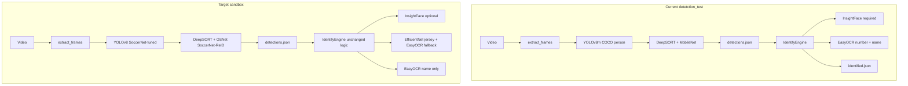
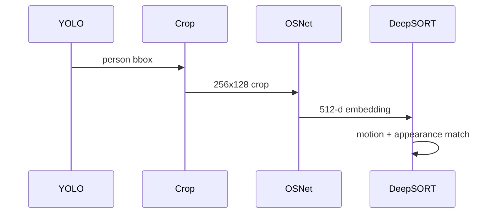

# Model Stack Migration Plan

## Executive decisions (locked in)


| Decision                            | Your choice                                                                                                  |
| ----------------------------------- | ------------------------------------------------------------------------------------------------------------ |
| Integration target                  | **[detetction_test/](detetction_test/) sandbox only** — backend FastAPI unchanged until validated            |
| Face (InsightFace)                  | **Optional** — used when `--photo` is provided; jersey/ReID/color drive lock otherwise                       |
| OSNet training                      | **In scope** — fine-tune OSNet-x1_0 on SoccerNet-ReID per spec below                                         |
| Other training (YOLO, jersey, ball) | **You supply weights** — drop into `detetction_test/weights/`                                                |
| Jersey numbers                      | **EfficientNet-B0 primary + EasyOCR fallback**                                                               |
| Ball                                | **Sandbox only** — separate JSON field or sidecar file, not wired to Next.js/API                             |
| Ship order                          | **1) YOLO → 2) OSNet tracker → 3) Jersey classifier → 4) Ball**                                              |
| SoccerNet access                    | **No credentials yet** — ship download/train/eval scripts first; run full training when NIPS creds are ready |


## Current vs target (what actually changes)




**Not a ground-up rebuild.** These stay as-is:

- Frame loop in [detetction_test/run_detect.py](detetction_test/run_detect.py)
- Lock/re-lock state machine in [detetction_test/identify.py](detetction_test/identify.py) (~500 lines)
- Weighted scoring API: `face, number_conf, name_sim, color`
- JSON contracts: `detections.json`, `identified.json`

**What gets replaced or added:**


| Component                 | File(s)                                                                                                                        | Effort                                   |
| ------------------------- | ------------------------------------------------------------------------------------------------------------------------------ | ---------------------------------------- |
| Detector weights + config | [detetction_test/detect.py](detetction_test/detect.py), CLI                                                                    | Low                                      |
| ReID embedder             | [detetction_test/tracker.py](detetction_test/tracker.py)                                                                       | Low — library already supports TorchReID |
| Jersey classifier         | new `jersey_number.py`, refactor [detetction_test/ocr_profile.py](detetction_test/ocr_profile.py)                              | Medium                                   |
| Optional face             | [detetction_test/run_identify.py](detetction_test/run_identify.py), [detetction_test/identify.py](detetction_test/identify.py) | Low                                      |
| Ball (sandbox)            | new `ball_detect.py`, extend `run_detect.py` output                                                                            | Low–medium                               |


---

## Scope split: you vs implementation


| Owner              | Responsibility                                                                                                                 |
| ------------------ | ------------------------------------------------------------------------------------------------------------------------------ |
| **Implementation** | **OSNet-x1_0** full pipeline: download SoccerNet-ReID, crop extraction, train, eval (Rank-1/mAP), export, DeepSORT integration |
| **You (separate)** | YOLO soccer, EfficientNet jersey, ball YOLO weights only                                                                       |
| **Implementation** | Wire all weights, CLI/env, optional face, sandbox validation                                                                   |


Phase 2 integration can use **Market-1501 pretrained OSNet** (torchreid default) until `osnet_x1_0_soccernet.pth` exists. Full ID-stability gains require training after SoccerNet credentials are obtained.

**Execution order (no creds yet):**

1. Implement all `training/reid_osnet/` scripts + `reid_extractor.py` + tracker wiring
2. Smoke-test pipeline on tiny synthetic crop folder or public ReID sample
3. When creds ready: `download_soccernet.py` → `extract_crops.py` → `train_osnet.py` → `eval_osnet.py` → copy weights → re-run `run_detect.py` on `testmatch2`

---

## Weight contract

### Produced by OSNet training (in scope)


| File                        | Location                                       | Notes                                      |
| --------------------------- | ---------------------------------------------- | ------------------------------------------ |
| `osnet_x1_0_soccernet.pth`  | `detetction_test/weights/`                     | Full `state_dict` from best val checkpoint |
| `osnet_x1_0_soccernet.onnx` | same                                           | Optional deployment export                 |
| `reid_metrics.json`         | `detetction_test/training/reid_osnet/outputs/` | Rank-1, mAP on test split                  |


Symlink or copy to `osnet_soccer_reid.pth` for tracker default path if we keep one canonical name in `WEIGHTS.md`.

### You deliver (out of scope for training)


| File                                       | Model                              |
| ------------------------------------------ | ---------------------------------- |
| `yolo_soccer.pt`                           | YOLOv8 soccer person detector      |
| `jersey_number_b0.pt` (+ optional `.json`) | EfficientNet jersey 1–99 + unknown |
| `yolov8n_ball.pt`                          | Ball detector                      |


Document formats in `detetction_test/WEIGHTS.md`.

---

## Phase 1 — Soccer-tuned YOLO detector

**Goal:** Better person boxes at broadcast distance (small players, occlusion).

**Your training (out of scope):** SoccerNet fine-tuned YOLOv8 **m/l** (or l-p2 if you build it) → export as `weights/yolo_soccer.pt`.

**Implementation:**

1. Update [detetction_test/detect.py](detetction_test/detect.py):
  - Default weights path via env `YOLO_WEIGHTS` (already pattern exists).
  - Keep `classes=[0]` only if weights remain COCO; if soccer-trained single-class model, drop class filter or use soccer class id from training config.
2. Update [detetction_test/README.md](detetction_test/README.md) with new default weights and `--weights` examples.

**Validation (on `testmatch2`):**

- Visual: open `frames/frame_XXXXXX.jpg` vs `detections.json` — box coverage on distant players.
- Metric (manual): count frames where a visible player has no box; compare before/after on same 100-frame slice.

**Deliverable:** `detections.json` with improved recall; same schema.

---

## Phase 2 — OSNet-x1_0 fine-tuning on SoccerNet-ReID (in scope)

**Goal:** 512-d appearance embeddings that cluster by player identity; use in DeepSORT to reduce ID switches.

**Target metrics (test set):** Rank-1 80–90%, mAP 75–85% (vs ~45–55% / ~30–40% with Market-1501 pretrained only).

### 2a — Dataset preparation

**Location:** configurable; default `SOCCERNET_DATA=/data/soccernet/` (document env var; allow project-local `detetction_test/data/soccernet/` for dev if `/data` unavailable).

1. **Download** via official API:
  - `SoccerNet.Downloader` — tracking annotations + videos
  - Script: `detetction_test/training/reid_osnet/download_soccernet.py`
2. **Extract player crops** (`extract_crops.py`):
  - Per video: read frame, parse `tracking_data.json`, crop bboxes
  - Save: `{data_root}/player_crops/{player_id}/{jersey_number}/{frame_id}.jpg`
  - **Filter:** skip crops with height < 50px
  - Expected scale: ~10k–50k crops/player across dataset, 100+ player identities
3. **PyTorch dataset** (`soccernet_reid_dataset.py`):
  - Output: `(image, player_id, camera_id)` — `camera_id` from match/video id for triplet sampling if needed
  - Resize: **256×128** (ReID standard)
  - Aug (train): `RandomHorizontalFlip`, `RandomRotation(10)`, `GaussianBlur`, `ColorJitter`
  - Split: **80% train / 20% test** (stratified by `player_id`)

### 2b — Model and loss

1. **Load pretrained:**

```python
   torchreid.models.build_model('osnet_x1_0', num_classes=N_players, pretrained=True)
   

```

- Market-1501 init; replace classifier head for `N_players` (dataset-dependent, not 751)

1. **Loss:** `loss = CrossEntropy + 0.5 * TripletLoss` (metric learning on 512-d features before classifier)

### 2c — Training loop

**Config** (`training/reid_osnet/config.yaml` or constants):


| Hyperparameter | Value                                                           |
| -------------- | --------------------------------------------------------------- |
| Optimizer      | Adam, lr=3e-4, weight_decay=5e-4                                |
| Batch size     | 64                                                              |
| Epochs         | 30                                                              |
| Early stopping | val_acc plateau 10 epochs                                       |
| Scheduler      | StepLR(step_size=10, gamma=0.1)                                 |
| Device         | CUDA (required for training; CPU fallback for smoke tests only) |


**Script:** `train_osnet.py` — log `train_loss`, `train_acc`, `val_acc`, `lr` per epoch; save best checkpoint.

**Optional:** `torch.cuda.amp` mixed precision if OOM at batch 64.

### 2d — Evaluation

**Script:** `eval_osnet.py`

- **Rank-1 (CMC):** query embedding → nearest gallery neighbor same `player_id`
- **mAP:** standard ReID evaluation (L2 or cosine on normalized 512-d vectors)
- Write `reid_metrics.json`; fail training sign-off if Rank-1 < 70% (tunable threshold)

### 2e — Export and feature extractor

1. `torch.save(model.state_dict(), 'weights/osnet_x1_0_soccernet.pth')`
2. **ONNX export** (`export_onnx.py`) — optional, for non-PyTorch deploy
3. `**reid_extractor.py`** — `FeatureExtractor` class:
  - Load weights, input BGR crop → **512-d L2-normalized** embedding
  - Same preprocessing as training (256×128, torchreid normalize)

### 2f — DeepSORT integration

`deep-sort-realtime` supports `embedder='torchreid'` natively. Update [detetction_test/tracker.py](detetction_test/tracker.py):

```python
DeepSort(
    max_age=max_age,
    n_init=n_init,
    embedder="torchreid",
    embedder_model_name="osnet_x1_0",
    embedder_wts="weights/osnet_x1_0_soccernet.pth",
    half=True,
    bgr=True,
)
```

**Also:**

- Add `torchreid` to [detetction_test/requirements.txt](detetction_test/requirements.txt) + `SoccerNet` downloader dep
- CLI: `--embedder`, `--reid-weights` on [detetction_test/run_detect.py](detetction_test/run_detect.py)
- Record embedder + weights path in `detections.json` `config`
- Fallback: `--embedder mobilenet` until trained weights exist

**Tracking flow (unchanged architecture):**




**Validation on `testmatch2`:**

- Follow one player 50+ frames — stable `id`
- Compare switch rate vs MobileNet baseline on same clip

**Deliverables:**

- `osnet_x1_0_soccernet.pth` + metrics JSON
- `reid_extractor.py` usable standalone
- Tracker wired and documented in README

---

## Phase 3 — EfficientNet jersey classifier + EasyOCR hybrid

**Goal:** Reliable digit reading on jersey backs; keep OCR only as fallback and for names.

**Your training (out of scope):** EfficientNet-B0 on jersey-back crops (1–99 + `**unknown`** class) → `weights/jersey_number_b0.pt` + optional `jersey_number_b0.json` (class index map).

### 3a — Runtime integration

1. New [detetction_test/jersey_number.py](detetction_test/jersey_number.py):
  - `JerseyNumberClassifier.predict(crop) -> (number | None, confidence)`
  - Threshold env `JERSEY_CLS_MIN_CONF` (e.g. 0.75).
2. Refactor [detetction_test/ocr_profile.py](detetction_test/ocr_profile.py) → `**JerseyNameOCR`** (EasyOCR for names only; remove digit path from primary flow).
3. Hybrid in identify scoring ([detetction_test/identify.py](detetction_test/identify.py) `_score_signals`):
  - Call classifier first on number crop.
  - If `conf < threshold` or class is `unknown`, fall back to EasyOCR `read_number`.
  - `number_conf` fed to weighted score unchanged.

### 3b — Optional face ([detetction_test/run_identify.py](detetction_test/run_identify.py))

- Make `--photo` optional.
- When absent: set `face_weight=0` in config or use a `NullFaceMatcher` returning 0.0; adjust initial lock to rely on `number` + `color` + cumulative ReID cues (may need slightly lower `lock_threshold` — tune on validation clips).
- When present: current InsightFace behavior unchanged.

**Validation (from [detetction_test/README.md](detetction_test/README.md) checklist):**

- Easy lock with photo + visible back.
- Re-lock after 60-frame absence using number.
- No lock when wrong photo (still `gave_up: true`).
- Margin guard with two same-kit teammates.

**Deliverable:** `identified.json` with higher `method: number` rate and fewer OCR errors on digits.

---

## Phase 4 — Ball detection (sandbox only)

**Goal:** Experimental ball positions alongside players; no API contract change.

**Your training (out of scope):** YOLOv8n ball detector → `weights/yolov8n_ball.pt`.

**Implementation:**

1. New [detetction_test/ball_detect.py](detetction_test/ball_detect.py) — load `weights/yolov8n_ball.pt`.
2. Extend [detetction_test/run_detect.py](detetction_test/run_detect.py):
  - Optional `--detect-ball` flag.
  - Add per-frame `balls: [{ bbox, conf }]` to `detections.json` (backward compatible — new key).
3. Document in README; explicitly **not** consumed by `run_identify.py` or backend.

**Validation:** spot-check 20 frames where ball is visible; confirm bbox on ball.

---

## OCR for player names (PaddleOCR replacement)

**Decision:** Do **not** add PaddleOCR. Keep **EasyOCR** for name crops only (already in [detetction_test/requirements.txt](detetction_test/requirements.txt); backend abandoned Paddle for the same reason).

If EasyOCR quality is insufficient after jersey upgrade, evaluate **docTR** as a drop-in replacement in `JerseyNameOCR` only — not in scope unless Phase 3 validation fails on names.

---

## Dependencies to add

**Core** ([detetction_test/requirements.txt](detetction_test/requirements.txt)):

```
torchreid              # pip install from KaiyangZhou/deep-person-reid
SoccerNet              # official downloader API
torch>=2.0
torchvision
# existing: ultralytics, deep-sort-realtime, easyocr, insightface
```

**Training-only** (`detetction_test/training/reid_osnet/requirements-train.txt`):

```
pyyaml                 # config
tensorboard or wandb   # optional logging
onnx onnxruntime       # ONNX export
```

Pin versions after GPU env smoke test. **Note:** SoccerNet download + CUDA training likely needs a Linux/GPU machine; document if macOS sandbox venv is inference-only.

---

## Suggested folder layout (new)

```
detetction_test/
├── weights/                         # gitignored
│   ├── osnet_x1_0_soccernet.pth     # produced by Phase 2 training
│   ├── osnet_x1_0_soccernet.onnx
│   ├── yolo_soccer.pt               # you supply
│   ├── jersey_number_b0.pt
│   └── yolov8n_ball.pt
├── training/reid_osnet/             # OSNet training (in scope)
│   ├── download_soccernet.py
│   ├── extract_crops.py
│   ├── soccernet_reid_dataset.py
│   ├── train_osnet.py
│   ├── eval_osnet.py
│   ├── export_onnx.py
│   ├── config.yaml
│   ├── requirements-train.txt
│   └── outputs/                     # metrics, checkpoints
├── reid_extractor.py                # 512-d embedding wrapper
├── jersey_number.py                 # Phase 3
├── ball_detect.py                   # Phase 4
└── WEIGHTS.md
```

Data on disk (gitignored): `SOCCERNET_DATA` or `detetction_test/data/soccernet/player_crops/`.

---

## Risks and mitigations


| Risk                                   | Mitigation                                                                              |
| -------------------------------------- | --------------------------------------------------------------------------------------- |
| YOLOv8l-p2 not available off-the-shelf | Start with `yolov8l` SoccerNet fine-tune; P2 only if needed                             |
| Track IDs change after each phase      | Re-run full `run_detect.py` → `run_identify.py`; don't compare IDs across runs          |
| Jersey classifier false positives      | `unknown` class + confidence gate + EasyOCR fallback                                    |
| Full-frame export disk cost            | Add optional `--sample-fps` or `--max-frames` for dev runs (future nice-to-have)        |
| Python 3.14 + torchreid compatibility  | Test install in Phase 2; fall back to custom embedder callable if needed                |
| SoccerNet download size / license      | Document disk (~100GB+ videos possible); use annotation-only + subset for dev           |
| No local GPU                           | Train on cloud GPU; copy `osnet_x1_0_soccernet.pth` into `weights/` for local inference |
| Triplet sampling with many IDs         | Use PK sampler (P identities, K images) standard in torchreid                           |
| TorchReID vs saved state_dict keys     | Save/load via torchreid `FeatureExtractor` API to match DeepSORT embedder               |
| YOLO/jersey weights not ready          | mobilenet + EasyOCR fallbacks until you drop files in `weights/`                        |


---

## Success criteria (per phase)


| Phase | Done when                                                                                                                      |
| ----- | ------------------------------------------------------------------------------------------------------------------------------ |
| 1     | Visible distant players get boxes; manual recall improved on `testmatch2` sample                                               |
| 2     | Rank-1 ≥ 80% on test split; tracker uses `osnet_x1_0_soccernet.pth`; fewer ID switches vs MobileNet on `testmatch2`            |
| 3     | Target player locks/re-locks with `method` including `number` on back-visible segments; digit accuracy > EasyOCR-only baseline |
| 4     | `balls[]` present in JSON when flag on; visually correct on spot check                                                         |


---

## Out of scope (this plan)

- **YOLO, EfficientNet jersey, ball training** — you supply weights
- Full SoccerNet video hosting (we download via API; you provide credentials/storage if needed)
- Merging into [backend/app/pipeline/](backend/app/pipeline/) or FastAPI — until sandbox sign-off
- Next.js / heat map wiring for ball
- Replacing EasyOCR for names (unless validation fails)
- Removing [detetction_test/color_score.py](detetction_test/color_score.py) — kept as weak tie-breaker

---

## After sandbox sign-off (future, not this plan)

1. Port Phase 1–3 modules into `backend/app/pipeline/`
2. Align env vars with [backend/README.md](backend/README.md)
3. Optional: stream frames instead of writing all JPGs to disk

