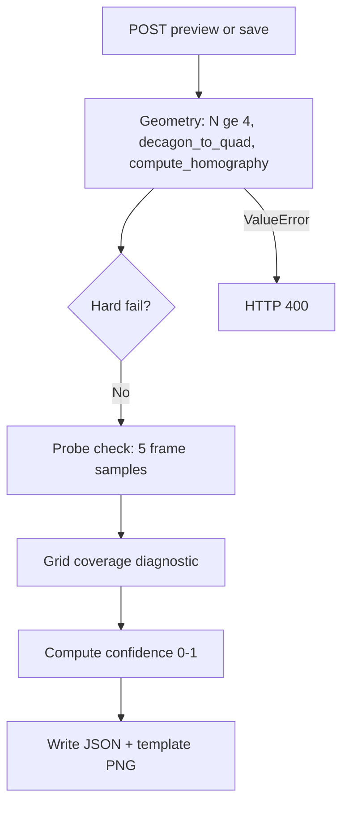
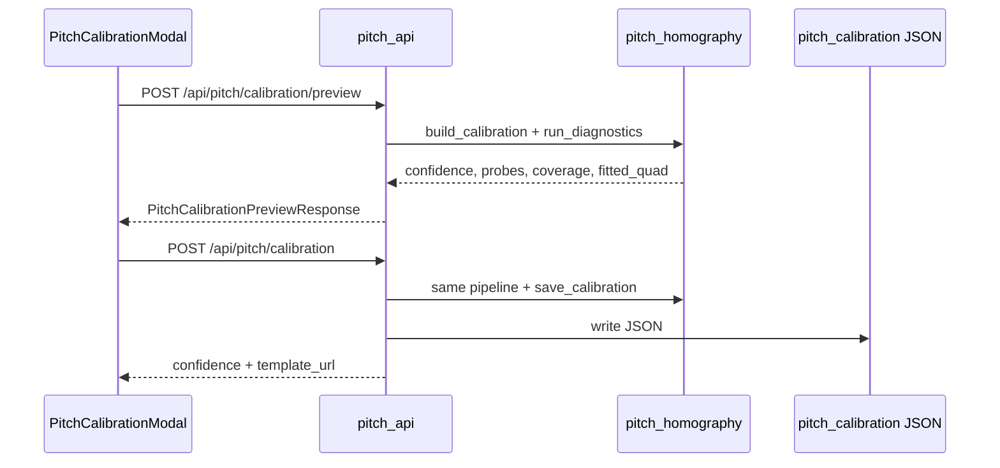

# Pitch Homography MVP — Implementation Plan

## Goals and non-goals

**Goals**
- Allow **4–20 outline points** in UI and API (not only 10).
- **Preview** homography before save (probes, coverage, confidence).
- **Soft validation**: bad geometry → HTTP 400; weak probes/coverage → save allowed with warnings + confidence 0–1.
- Persist optional metadata (`mode`, `confidence`, `coverage_pct`) in [`backend/app/pipeline/pitch_homography.py`](backend/app/pipeline/pitch_homography.py) JSON.
- Keep **N=10 behavior identical** (indices `0,3,6,9` in `decagon_to_quad`).

**Non-goals (this delivery)**
- Labeled landmark mode (`findHomography` + `LANDMARK_COORDS`) — follow-up phase.
- scipy quad optimizer, hull self-intersect checks, heatmap cluster gate on save.

## Save policy (single source of truth)

| Condition | HTTP | User sees |
|-----------|------|-----------|
| N &lt; 4, invalid quad, `compute_homography` fails | **400** | Error detail |
| Probes &lt; 3/5 or coverage &lt; 60% | **200** (save) / preview OK | Warnings + low confidence |

Today [`pitch_api._build_calibration_from_request`](backend/app/pitch_api.py) **always hard-fails** on probe check via `validate_calibration_maps_to_pitch` — this must become soft for save/preview only.

---

## Architecture

**Key files**

| Layer | File |
|-------|------|
| Core math | [`backend/app/pipeline/pitch_homography.py`](backend/app/pipeline/pitch_homography.py) |
| API | [`backend/app/pitch_api.py`](backend/app/pitch_api.py), [`backend/app/main.py`](backend/app/main.py) |
| Schemas | [`backend/app/schemas.py`](backend/app/schemas.py) |
| UI | [`src/components/PitchCalibrationModal.tsx`](src/components/PitchCalibrationModal.tsx), [`src/lib/pitchCalibration.ts`](src/lib/pitchCalibration.ts), [`src/lib/api.ts`](src/lib/api.ts) |
| Tests | [`backend/tests/test_pitch_homography.py`](backend/tests/test_pitch_homography.py), [`backend/tests/test_calibration_validation.py`](backend/tests/test_calibration_validation.py), [`backend/tests/test_pitch_calibration_api.py`](backend/tests/test_pitch_calibration_api.py) |
| Docs | [`backend/data/pitch_calibration/README.md`](backend/data/pitch_calibration/README.md) |

**Storage rule:** Keep recomputing `H` from `image_corners` in `from_dict` for outline mode. New optional fields are metadata only (`confidence`, `coverage_pct`, `mode: "outline"`). Do **not** store a separate `homography` that can diverge from corners until landmark mode exists.

---

## Phase 1 — Backend validation and diagnostics

### 1.1 Constants and types
- Add `MIN_BOUNDARY_POINTS = 4`, `MAX_BOUNDARY_POINTS = 20` in `pitch_homography.py`.
- Add frozen dataclass `CalibrationDiagnostics` (or typed dict): `probe_count`, `probe_total`, `probe_details`, `coverage_pct`, `warnings`, `fitted_quad`, `mode`.

### 1.2 Refactor probe validation
- Change `validate_calibration_maps_to_pitch(cal)` to **`probe_calibration(cal) -> tuple[int, list[dict]]`** returning count in-bounds + per-probe `{px, py, x_m, y_m, on_pitch}`.
- Keep thin `validate_calibration_maps_to_pitch` that raises if count &lt; 3 (for tests/tools that still want hard fail).

### 1.3 Grid coverage helper
- Add `compute_grid_coverage(cal, *, grid_x=5, grid_y=4) -> float` using existing `meters_to_pixel` + frame bounds (same logic as revised spec; no new deps).

### 1.4 Confidence scorer
- Add `compute_calibration_confidence(*, probe_count, coverage_pct) -> float`:
  - Baseline `0.5`
  - `+0.3` if `probe_count >= 3`
  - `+0.2` if `coverage_pct >= 0.7`
  - Clamp to `[0.2, 1.0]` when probes fail (never imply “good” when probes &lt; 3)
  - Append human-readable `warnings` (e.g. low coverage, probes failed)

### 1.5 Unified builder
- Add `build_calibration_with_diagnostics(name, image_boundary_points, *, image_size, frame_index, video_path, ...) -> tuple[PitchCalibration, CalibrationDiagnostics]`:
  - Call existing `build_calibration`
  - Run `probe_calibration` + `compute_grid_coverage` + `compute_calibration_confidence`
  - **Do not raise** on probe failure

### 1.6 Extend `PitchCalibration` serialization
- Add optional fields to `to_dict` / `from_dict`: `mode` (default `"outline"`), `confidence`, `coverage_pct` (ignore on load if missing).
- Extend frozen dataclass with optional `confidence: float | None`, `coverage_pct: float | None`, `mode: str` (defaults).

### 1.7 Point-count validation in `build_calibration`
- In `decagon_to_quad` path: if `N > MAX_BOUNDARY_POINTS`, raise clear `ValueError`.
- Document that N=10 still uses `BOUNDARY_CORNER_INDICES`.

**Verify:** `pytest backend/tests/test_pitch_homography.py backend/tests/test_calibration_validation.py -q`

---

## Phase 2 — API schema and endpoints

### 2.1 Relax `PitchCalibrationSaveRequest`
In [`backend/app/schemas.py`](backend/app/schemas.py):
- Validator: accept `image_boundary_points` with `4 <= len <= 20`.
- Still accept `image_corners` length 4 or 10 (legacy).
- Add optional `point_labels` field **reserved** (reject if non-empty in MVP with 400 “not supported yet”) OR omit until landmark phase.

### 2.2 Preview response models
- `PitchCalibrationPreviewRequest` — same fields as save (name, frame_index, boundary/corners).
- `PitchCalibrationPreviewResponse` — `confidence`, `coverage_pct`, `probe_count`, `probe_total`, `warnings`, `fitted_quad` (4 corners), `diagnostics` optional nested.

### 2.3 Extend save response
- Add to `PitchCalibrationSaveResponse`: `confidence`, `coverage_pct`, `warnings` (list[str]).

### 2.4 `pitch_api` refactor
- Extract `_calibration_from_request(body, video_path) -> tuple[PitchCalibration, CalibrationDiagnostics]` using `build_calibration_with_diagnostics`.
- **`preview_pitch_calibration(body)`** — no disk write; return preview response.
- **`save_pitch_calibration`** — hard-fail only on `ValueError` from build; **remove** hard `validate_calibration_maps_to_pitch` raise; attach diagnostics to response; then existing template/overlay write.

### 2.5 Routes in `main.py`
- `POST /api/pitch/calibration/preview` → preview handler.

### 2.6 Legacy upload path
In [`backend/app/main.py`](backend/app/main.py) `pitch_calibration_upload`:
- Accept boundary length **4–20** (not only 4 or 10).
- Pass through `image_boundary_points` when `len >= 4`.

**Verify:** `pytest backend/tests/test_pitch_calibration_api.py -q`

---

## Phase 3 — Backend tests (micro-suite)

| Test | File |
|------|------|
| N=5,7,15 outline → 4 corners, roundtrip | `test_pitch_homography.py` |
| N=10 → same quad as corner indices test (regression) | `test_pitch_homography.py` |
| N=3 → 400 / ValueError | `test_pitch_calibration_api.py` |
| Good quad → preview confidence ≥ 0.8 | new `test_calibration_preview.py` |
| `testmatch2.json` → preview probes &lt; 3, low confidence, save still 200 if geometry OK | `test_calibration_validation.py` |
| Old JSON without new fields loads | `test_pitch_homography.py` |
| Save response includes `confidence` | `test_pitch_calibration_api.py` |

---

## Phase 4 — Frontend constants and API client

### 4.1 Shared limits
- In [`src/lib/pitchCalibration.ts`](src/lib/pitchCalibration.ts): export `MIN_BOUNDARY_POINTS = 4`, `MAX_BOUNDARY_POINTS = 20`.
- Ensure `decagonToQuad` matches backend for N≠10 (already implemented; add unit test in Vitest if present, or manual parity note).

### 4.2 API types and calls — [`src/lib/api.ts`](src/lib/api.ts)
- Add `PitchCalibrationPreviewResponse` type.
- `previewPitchCalibration(payload)` → `POST .../preview`.
- Extend `savePitchCalibration` return type with `confidence`, `warnings`, `coverage_pct`.

---

## Phase 5 — UI: flexible placement + preview step

### 5.1 Modal state machine
Add step: `"place" | "preview"` in [`PitchCalibrationModal.tsx`](src/components/PitchCalibrationModal.tsx).

### 5.2 Placement step changes
- Replace fixed `BOUNDARY_POINT_COUNT` gate with `MIN`/`MAX`:
  - Place until `points.length < MAX`; stop accepting at MAX.
  - Show **derived quad** when `points.length >= 4` (not only at 10).
  - Progress: `"7 points placed (min 4, max 20)"`.
  - Optional: keep `BOUNDARY_LABELS[i]` for i&lt;10; generic `"Outline point N"` after.
- **Validate & Preview** button enabled when `points.length >= 4`.
- Remove save from footer in place step (or disabled until preview passed).

### 5.3 Preview step UI
- On click **Validate & Preview**: call `previewPitchCalibration`.
- Display:
  - Confidence % (bar or text)
  - Probes: `3/5 on pitch`
  - Coverage %
  - Warnings list (amber)
  - Keep green quad overlay on canvas
- Buttons: **Adjust points** (back to place), **Save calibration** (enabled always if preview returned 200; show warning if confidence &lt; 0.5).

### 5.4 Save handler
- Require `points.length >= 4` (not 10).
- POST save; surface `warnings` in success/error area.
- Legacy upload: unchanged payload shape (boundary array).

### 5.5 Accessibility
- Update `canvasAriaLabel` / progress strings for variable N.
- Announce confidence/warnings in `aria-live` region on preview.

### 5.6 Styles
- Minimal additions in [`PitchCalibrationModal.module.css`](PitchCalibrationModal.module.css) for preview panel (warnings, confidence).

**Verify:** Manual — open modal, 6 points, preview, save; re-open loads boundary points.

---

## Phase 6 — Tooling and docs

### 6.1 CLI [`backend/tools/annotate_pitch.py`](backend/tools/annotate_pitch.py)
- Document 4–20 boundary points if interactive mode supports it (optional small change: accept N≥4 clicks).

### 6.2 README
- Update [`backend/data/pitch_calibration/README.md`](backend/data/pitch_calibration/README.md): preview endpoint, confidence, 4–20 points, soft vs hard validation.

### 6.3 Optional: analyze surfacing
- If analyze response already exposes calibration name, consider logging `confidence` in pipeline when calibration loaded (read-only warning in logs) — **skip UI** unless trivial hook in Dashboard.

---

## Phase 7 — Manual QA checklist

1. Wide shot: 6 outline points → preview confidence high → save → heatmap sane.
2. Exactly 10 points clockwise → same quad as before (compare `image_corners` in JSON).
3. `testmatch2` frame: preview shows low probes; save with warning; user understands limitation.
4. Legacy upload with 8 boundary points succeeds.
5. Old `testmatch2.json` still loads in analyze without crash.

---

## Follow-up phase (not in MVP): Labeled landmarks

Deferred per your choice; sketch for later:
- `LANDMARK_COORDS` dict + UI dropdown per point
- `cv2.findHomography(..., RANSAC)` branch in `build_calibration`
- `from_dict` branch: use stored H when `mode == "landmark"`
- Pixel round-trip reprojection validation

---

## Risk mitigations

| Risk | Mitigation |
|------|------------|
| Client/server quad mismatch | Preview uses server `fitted_quad`; client preview quad is cosmetic only |
| Bad calibrations saved | Low confidence + warnings; probes still visible in preview |
| Breaking old JSON | New fields optional; `from_dict` unchanged recompute path |
| Upload still 10-only | Update `main.py` length check in same PR |
