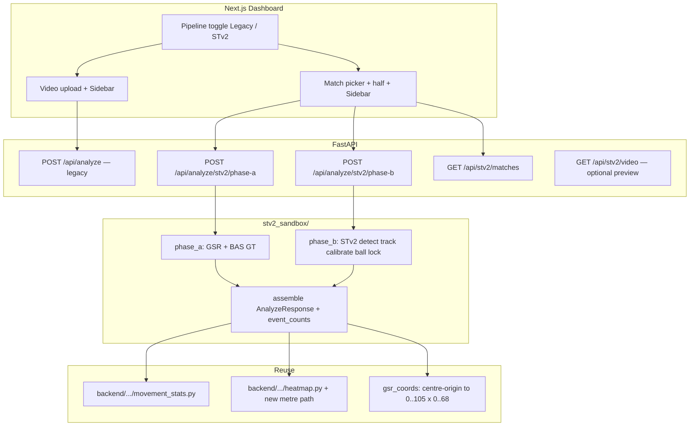

<!-- Original overview: Add `stv2_sandbox/` with Phase A (GSR/BAS GT) and Phase B (inference). Phase A deleted from codebase. -->
todos:
  - id: 0-01
    content: Add git submodule third_party/SoccerTrack-v2 (pinned) + README init instructions
    status: completed
  - id: 0-02
    content: Create stv2_sandbox/ package skeleton + config env loading
    status: completed
  - id: 0-03
    content: Document STV2_DATA_ROOT / STV2_SUBMODULE in .env.example + backend README
    status: completed
  - id: 0-04
    content: verify_data_layout.py script for dataset tree
    status: completed
  - id: 0-05
    content: gsr_coords.py centre→corner transform + unit tests
    status: completed
  - id: 1-01
    content: movement adapter for (t,x_m,y_m) points without bbox
    status: completed
  - id: 1-02
    content: build_heatmap_from_metre_points() + test
    status: completed
  - id: 1-03
    content: shared/gsr_loader.py filter by jersey
    status: completed
  - id: 1-04
    content: shared/bas_loader.py + 12-class aggregate
    status: completed
  - id: 1-05
    content: shared/assemble_response.py → Stv2AnalyzeResponse
    status: completed
  - id: 1-06
    content: Golden fixture test for events + movement
    status: completed
  - id: 2-01
    content: phase_a/run.py CLI argparse
    status: completed
  - id: 2-02
    content: "Phase A: GSR → movement"
    status: completed
  - id: 2-03
    content: "Phase A: GSR → heatmap"
    status: completed
  - id: 2-04
    content: "Phase A: BAS → event_counts"
    status: completed
  - id: 2-05
    content: pipeline.json schema doc
    status: completed
  - id: 2-06
    content: Phase A manual smoke on real match
    status: completed
  - id: 3-01
    content: Pydantic Stv2 schemas in backend
    status: completed
  - id: 3-02
    content: GET /api/stv2/matches
    status: completed
  - id: 3-03
    content: POST /api/analyze/stv2/phase-a
    status: completed
  - id: 3-04
    content: FastAPI tests phase-a
    status: completed
  - id: 3-05
    content: Optional GET /api/stv2/video preview
    status: completed
  - id: 4-01
    content: TypeScript Stv2AnalyzeResponse types
    status: completed
  - id: 4-02
    content: api.ts analyzeStv2PhaseA + fetchStv2Matches
    status: completed
  - id: 4-03
    content: Stv2MatchPicker component
    status: completed
  - id: 4-04
    content: Dashboard Legacy/STv2 toggle
    status: completed
  - id: 4-05
    content: BasEventsPanel 12 labels
    status: completed
  - id: 4-06
    content: HeatMapPanel wire STv2 response
    status: completed
  - id: 4-07
    content: E2E manual test Phase A UI
    status: completed
  - id: 5-01
    content: phase_b/video_resolver.py
    status: completed
  - id: 5-02
    content: run_stv2_command subprocess wrapper
    status: completed
  - id: 5-03
    content: Document ball tracker choice after submodule inspect
    status: completed
  - id: 5-04
    content: phase_b/calibrate.py
    status: completed
  - id: 5-05
    content: phase_b/detect_track.py
    status: completed
  - id: 6-01
    content: phase_b/identify lock adapter
    status: completed
  - id: 6-02
    content: phase_b/trajectory metre points
    status: completed
  - id: 6-03
    content: Phase B movement + heatmap reuse
    status: completed
  - id: 6-04
    content: phase_b/ball_track.py
    status: completed
  - id: 6-05
    content: phase_b/run.py CLI E2E
    status: completed
  - id: 6-06
    content: Phase A vs B sanity comparison script
    status: completed
  - id: 7-01
    content: POST /api/analyze/stv2/phase-b + tests
    status: completed
  - id: 7-02
    content: api.ts analyzeStv2PhaseB
    status: completed
  - id: 7-03
    content: Dashboard Phase B button
    status: completed
  - id: 7-04
    content: UI provenance + ball_samples
    status: completed
  - id: 7-05
    content: E2E Phase A + Phase B same match
    status: completed
  - id: 8-01
    content: "Deferred: inferred BAS event_counts"
    status: completed
  - id: 8-02
    content: Duplicate jersey UI warning
    status: completed
  - id: 8-03
    content: CI submodule + fixture tests
    status: completed
  - id: 8-04
    content: Promotion design doc to backend pipeline
    status: completed
isProject: false
---

# Sandbox 3: SoccerTrack-v2 end-to-end pipeline

## Locked decisions (from your answers)


| Topic         | Choice                                                                                      |
| ------------- | ------------------------------------------------------------------------------------------- |
| STv2 in repo  | Git submodule at `[third_party/SoccerTrack-v2](third_party/SoccerTrack-v2)` (pinned commit) |
| UI            | **Toggle** Legacy vs STv2; **two endpoints** (not one merged analyze)                       |
| Phase A input | **Match picker** (`match_id` + half) — no video upload                                      |
| Player filter | **Jersey number only** (ignore `team_side`; document duplicate-jersey risk)                 |
| Events        | **Expand UI** to surface all 12 BAS classes (not only goals/shots/passes)                   |
| Phase B video | **STv2 panoramic half clips only** (server-side paths; no arbitrary user MP4 in Phase B)    |


## Architecture




## Critical technical constraint (must not assume away)

**Coordinate systems differ:**

- SoccerTrack GSR: metres, **origin at pitch centre** (`x ∈ [-52.5, 52.5]`, `y ∈ [-34, 34]` per [STv2 format-gsr](https://github.com/AtomScott/SoccerTrack-v2/blob/main/docs/format-gsr.md)).
- Your product heatmap/movement: **corner-origin** `[0, 105] × [0, 68]` via `[PitchCalibration](backend/app/pipeline/pitch_homography.py)` and `[meter_positions_from_rows](backend/app/pipeline/heatmap.py)`.

Sandbox 3 must implement an explicit transform in one module (e.g. `[stv2_sandbox/shared/gsr_coords.py](stv2_sandbox/shared/gsr_coords.py)`) and unit-test round-trip sanity (centre → corner → heatmap bin).

**Row model today:** `[Row.x` / `Row.y](backend/app/schemas.py)` in legacy pipeline are **normalized image coords** (0–1), not metres. STv2 sandbox will either:

- emit metre rows via a new optional field (`x_m`, `y_m`) + adapter in `trajectory_points_from_rows`, **or**
- add `build_heatmap_from_metre_points()` that bypasses bbox/homography (recommended; keeps legacy untouched).

## Data layout (not in git)


| Env var          | Purpose                                                                       |
| ---------------- | ----------------------------------------------------------------------------- |
| `STV2_DATA_ROOT` | Hugging Face / manual dataset root containing `gsr/`, `bas/`, and half videos |
| `STV2_SUBMODULE` | Default `third_party/SoccerTrack-v2`                                          |


Document in `[stv2_sandbox/README.md](stv2_sandbox/README.md)`: download steps (`atomscott/soccertrack-v2` on HF), expected tree:

```
$STV2_DATA_ROOT/
  gsr/{match_id}/{match_id}_1st.json
  bas/{match_id}/{match_id}_12_class_events.json
  videos/{match_id}/{match_id}_panorama_1st_half.mp4   # or STv2 interim naming — normalize in loader
```

**Do not assume** video paths until first `GET /api/stv2/matches` scan task confirms on-disk layout.

## API contract extensions

Keep `[AnalyzeResponse](backend/app/schemas.py)` for movement + heatmap + rows + target.

Add parallel event payload (new Pydantic models in `[backend/app/schemas.py](backend/app/schemas.py)`):

```python
# conceptual
class BasEventCounts(BaseModel):
    Pass: int
    Drive: int
    Header: int
    HighPass: int  # alias "High Pass" in JSON
    Out: int
    Cross: int
    ThrowIn: int
    Shot: int
    BallPlayerBlock: int
    PlayerSuccessfulTackle: int
    FreeKick: int
    Goal: int

class Stv2AnalyzeResponse(AnalyzeResponse):
    pipeline: Literal["stv2_phase_a", "stv2_phase_b"]
    match_id: str
    half: Literal["1st", "2nd"]
    event_counts: BasEventCounts
    provenance: Literal["gt", "inferred"]
    # Phase B only:
    ball_samples: int | None = None
```

Frontend: extend `[src/types/analysis.ts](src/types/analysis.ts)` + `[PlayerMetricsPanel](src/components/PlayerMetricsPanel.tsx)` or new `**BasEventsPanel**` for 12 BAS rows; keep `[distanceCoveredKm](src/components/Dashboard.tsx)` from `movement`.

## UI end-to-end (Legacy toggle)

Changes in `[src/components/Dashboard.tsx](src/components/Dashboard.tsx)`, `[src/lib/api.ts](src/lib/api.ts)`, new `[src/components/Stv2MatchPicker.tsx](src/components/Stv2MatchPicker.tsx)`:


| Mode         | Analyze trigger                                          | Required inputs                                              |
| ------------ | -------------------------------------------------------- | ------------------------------------------------------------ |
| Legacy       | `analyzeVideo()` → `POST /api/analyze`                   | MP4/MOV upload + sidebar                                     |
| STv2 Phase A | `analyzeStv2PhaseA()` → `POST /api/analyze/stv2/phase-a` | `match_id`, `half`, sidebar (jersey required)                |
| STv2 Phase B | `analyzeStv2PhaseB()` → `POST /api/analyze/stv2/phase-b` | Same picker fields; runs inference on server STv2 half video |


- Toggle persists in component state (optional: `localStorage`).
- STv2 mode **disables** video upload control; shows match picker + half selector.
- Sub-toggle or segmented control: **Phase A (GT)** vs **Phase B (Inference)**.
- Optional preview: `GET /api/stv2/video?match_id&half` if file exists under `STV2_DATA_ROOT`.
- Map `event_counts` → expanded metrics panel; `movement` → distance card (same as today).

## Phase A pipeline (GT)

**Input:** `match_id`, `half`, `PlayerDetails` (jersey required; name/colors optional for Phase A).

**Steps:**

1. Load GSR JSON: `gsr/{match_id}/{match_id}_{half}.json`.
2. Filter records: `jersey_number == details.jerseyNumber` (skip `null` jerseys); if multiple `track_id`s, pick track with most frames (document in README).
3. Convert `(x, y)` GSR → product metres; build `Row`-like list (`frame` = `image_id`, `t` = `image_id / 25`).
4. `compute_movement_stats(points)` — direct points API (add thin wrapper; avoid fake bbox).
5. `build_heatmap_from_metre_points(...)` — new shared helper using existing bin/render in `[heatmap.py](backend/app/pipeline/heatmap.py)`.
6. Load BAS JSON; filter events for locked player:
  - Prefer `player_id` when present on GSR majority track;
  - Else match `jersey_number` on GSR at `image_id` from BAS `position` (jersey-only fallback).
7. Count all 12 labels into `BasEventCounts` (dual Shot+Goal at same ms = **two increments** — STv2 edge case).
8. Assemble `Stv2AnalyzeResponse` with `provenance=gt`, synthetic `VideoMeta` (105×68 context, 25 fps, frame count from GSR).

**CLI mirror:** `python -m stv2_sandbox.phase_a.run --match-id 117093 --half 1st --jersey 9` → `output/{match_id}_{half}_j{jersey}/pipeline.json`.

## Phase B pipeline (inference, STv2 clips only)

**Input:** same match picker (server resolves video path).

**Steps (replace GT slices incrementally):**

1. Resolve half video under `STV2_DATA_ROOT` (fail fast with clear error if missing).
2. **Calibration:** run STv2 submodule `generate_calibration_mappings` + apply (or load precomputed `homography.npy` from interim if dataset ships it) → product `PitchCalibration` or metre projector compatible with `[movement_stats](backend/app/pipeline/movement_stats.py)`.
3. **Detect + track:** STv2 `detect_objects` / MOT CSV → normalize to internal detections JSON (same shape as `[detetction_test](detetction_test/)` `detections.json` frames/tracks).
4. **Lock player:** port `[detetction_test/identify.py](detetction_test/identify.py)` scoring (number + color; face optional) — **do not** assume InsightFace installed unless already in env.
5. **Trajectory:** foot bbox → homography → metre points; same movement + heatmap as Phase A output shape.
6. **Ball:** invoke STv2 `[src/ball_tracking/](https://github.com/AtomScott/SoccerTrack-v2/tree/main/src/ball_tracking)` (TrackNetX or BoT-SORT path — **pick one in implementation task  B-07** after inspecting submodule README/scripts).
7. **Events (inferred):** Phase B milestone 1 = `event_counts` empty or `provenance=inferred` with ball_samples only; milestone 2 = BAS baseline or proximity heuristics (separate task block **B-events** — do not block Phase B “done” on trained BAS).
8. Assemble `Stv2AnalyzeResponse` with `provenance=inferred`.

**CLI mirror:** `python -m stv2_sandbox.phase_b.run --match-id ... --half ... --jersey ...`.

## Dependency isolation

- Submodule: `third_party/SoccerTrack-v2` via `uv` (Python 3.12+ per upstream).
- `[stv2_sandbox/](stv2_sandbox/)` uses **subprocess** to STv2 CLI for heavy steps (avoids merging `uv.lock` into `[backend/requirements.txt](backend/requirements.txt)` on day one).
- Parent backend adds only lightweight deps for new routes + JSON loaders.
- `[.gitignore](.gitignore)`: `STV2_DATA_ROOT` contents, `stv2_sandbox/output/`.

## Promotion path (after sandbox validation)

Not in initial execution scope; documented for later:

- Point `POST /api/analyze/stv2/phase-b` implementation at promoted modules under `backend/app/pipeline/stv2/`.
- Single production endpoint only if toggle removed.

## Execution discipline

**One thin task per PR/commit step** — finish + verify before next. Suggested verification per task: unit test, CLI smoke, or `curl` API check.

---

## Task breakdown (execute in order)

### Block 0 — Repo foundation


| ID   | Task                                                                                                                              |
| ---- | --------------------------------------------------------------------------------------------------------------------------------- |
| 0-01 | Add git submodule `third_party/SoccerTrack-v2` at pinned commit; document `git submodule update --init` in README                 |
| 0-02 | Create `[stv2_sandbox/](stv2_sandbox/)` package skeleton (`__init__.py`, `README.md`, `config.py` env loading)                    |
| 0-03 | Add `STV2_DATA_ROOT`, `STV2_SUBMODULE` to `[.env.local.example](.env.local.example)` and `[backend/README.md](backend/README.md)` |
| 0-04 | Write dataset download/verify script `stv2_sandbox/scripts/verify_data_layout.py` (lists missing paths)                           |
| 0-05 | Add `gsr_coords.py` + unit tests (centre → corner metres; sample GSR point)                                                       |


### Block 1 — Shared assembly + heatmap metre path


| ID   | Task                                                                                                      |
| ---- | --------------------------------------------------------------------------------------------------------- |
| 1-01 | Add `trajectory_points_from_metres()` or extend movement adapter to accept `(t, x_m, y_m)[]` without bbox |
| 1-02 | Add `build_heatmap_from_metre_points()` in `[heatmap.py](backend/app/pipeline/heatmap.py)` + test         |
| 1-03 | Implement `stv2_sandbox/shared/gsr_loader.py` (load + filter GSR by jersey)                               |
| 1-04 | Implement `stv2_sandbox/shared/bas_loader.py` + `aggregate_bas_events()` for 12 classes                   |
| 1-05 | Implement `stv2_sandbox/shared/assemble_response.py` → `Stv2AnalyzeResponse` dict                         |
| 1-06 | Golden test: one fixture JSON fragment → expected `event_counts` + movement on synthetic points           |


### Block 2 — Phase A CLI


| ID   | Task                                                         |
| ---- | ------------------------------------------------------------ |
| 2-01 | `phase_a/run.py` CLI argparse (`match_id`, `half`, `jersey`) |
| 2-02 | Wire GSR → rows → movement stats                             |
| 2-03 | Wire GSR → heatmap PNG base64 in output JSON                 |
| 2-04 | Wire BAS → `event_counts` with jersey-only player linking    |
| 2-05 | Write `pipeline.json` schema doc in `stv2_sandbox/README.md` |
| 2-06 | Manual smoke: one real match from `STV2_DATA_ROOT`           |


### Block 3 — Phase A API + match picker API


| ID   | Task                                                                                    |
| ---- | --------------------------------------------------------------------------------------- |
| 3-01 | Pydantic `BasEventCounts`, `Stv2AnalyzeResponse`, `Stv2PhaseARequest` in schemas        |
| 3-02 | `GET /api/stv2/matches` — scan `gsr/` dirs; return `{ match_id, halves_available[] }`   |
| 3-03 | `POST /api/analyze/stv2/phase-a` — call sandbox assembler; return `Stv2AnalyzeResponse` |
| 3-04 | FastAPI tests: phase-a 404 when data missing; 200 with fixture                          |
| 3-05 | Optional `GET /api/stv2/video` — stream half MP4 if present                             |


### Block 4 — UI Phase A


| ID   | Task                                                                                                   |
| ---- | ------------------------------------------------------------------------------------------------------ |
| 4-01 | Add `Stv2AnalyzeResponse` + `BasEventCounts` types in `[src/types/analysis.ts](src/types/analysis.ts)` |
| 4-02 | `analyzeStv2PhaseA()` + `fetchStv2Matches()` in `[src/lib/api.ts](src/lib/api.ts)`                     |
| 4-03 | Build `[Stv2MatchPicker.tsx](src/components/Stv2MatchPicker.tsx)`                                      |
| 4-04 | Dashboard pipeline toggle + disable upload in STv2 mode                                                |
| 4-05 | New `BasEventsPanel` (12 BAS labels)                                                                   |
| 4-06 | Wire heatmap panel to STv2 response (reuse `[HeatMapPanel](src/components/HeatMapPanel.tsx)`)          |
| 4-07 | Wire distance from `movement`; manual E2E test Phase A                                                 |


### Block 5 — Phase B infrastructure


| ID   | Task                                                                              |
| ---- | --------------------------------------------------------------------------------- |
| 5-01 | `stv2_sandbox/phase_b/video_resolver.py` — map match_id+half → file path          |
| 5-02 | Subprocess wrapper `run_stv2_command(cmd, config)` with logging                   |
| 5-03 | Inspect submodule; document chosen ball tracker (TrackNetX vs BoT-SORT) in README |
| 5-04 | `phase_b/calibrate.py` — produce/load homography for match                        |
| 5-05 | `phase_b/detect_track.py` — STv2 YOLO + association → internal detections JSON    |


### Block 6 — Phase B lock + metrics


| ID   | Task                                                                                                                 |
| ---- | -------------------------------------------------------------------------------------------------------------------- |
| 6-01 | Copy/adapt identify runner into `stv2_sandbox/phase_b/identify.py` (import from `detetction_test` or thin duplicate) |
| 6-02 | `phase_b/trajectory.py` — locked track → metre points                                                                |
| 6-03 | Reuse movement + heatmap builders (same as Phase A output)                                                           |
| 6-04 | `phase_b/ball_track.py` — subprocess + frame-aligned ball positions JSON                                             |
| 6-05 | `phase_b/run.py` CLI end-to-end on one match                                                                         |
| 6-06 | Compare Phase A vs Phase B movement on same match (sanity report script)                                             |


### Block 7 — Phase B API + UI


| ID   | Task                                                        |
| ---- | ----------------------------------------------------------- |
| 7-01 | `POST /api/analyze/stv2/phase-b` + tests                    |
| 7-02 | `analyzeStv2PhaseB()` in api.ts                             |
| 7-03 | Dashboard Phase B button + loading/error states             |
| 7-04 | Show `provenance` + optional `ball_samples` in UI           |
| 7-05 | Full E2E: toggle STv2 → Phase A → Phase B same match/jersey |


### Block 8 — Hardening (post-MVP)


| ID   | Task                                                                             |
| ---- | -------------------------------------------------------------------------------- |
| 8-01 | **B-events:** BAS baseline or ball-proximity heuristic → inferred `event_counts` |
| 8-02 | Handle duplicate jersey ambiguity (UI warning when >1 track_id)                  |
| 8-03 | CI: submodule init + fixture tests without full dataset                          |
| 8-04 | Promotion design doc: merge into `backend/app/pipeline/`                         |


## Risks called out (no assumptions)

- **Jersey-only filter** may lock wrong player if duplicate numbers on pitch — surface warning in UI when multiple `track_id`s match.
- **STv2 video path naming** may differ from our `videos/` convention — resolved in task 5-01, not assumed here.
- **Phase B events** are explicitly split to Block 8; Phase B ships movement + heatmap + ball track metadata first.
- **Sidebar photo** is not sent to API today; Phase B identify should match `[detetction_test](detetction_test/)` optional photo behavior unless you add multipart later.

## Success criteria

1. **Phase A:** Match picker → API → heatmap + distance + 12 BAS counts populated in UI (`provenance=gt`).
2. **Phase B:** Same picker → inference on STv2 half video → heatmap + distance in UI (`provenance=inferred`); ball stage produces frame-aligned output file.
3. **Legacy toggle** unchanged for existing `POST /api/analyze` upload flow.
4. All tasks executable **one ID at a time** with a defined verification step.

