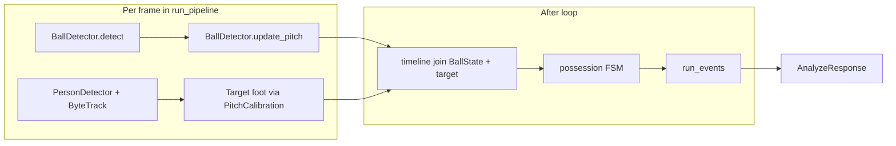

# Target-player ball events (upload pipeline)

## Goal

After player lock in [`backend/app/pipeline/run.py`](backend/app/pipeline/run.py), infer **only the locked player’s** ball stats: **Pass**, **Shot**, **Goal**, **Drive**. Surface **goals / shots / passes** in [`src/types/playerMetrics.ts`](src/types/playerMetrics.ts); Drive can stay API-only in v1.

**Out of scope:** match-wide stats, full 12-class BAS taxonomy, STv2 (removed from codebase).

## Architecture



**Kalman lives in `ball_detector.py`** — not a separate timeline smoothing pass. `timeline.py` only joins per-frame `BallState` with target samples.

**Possession is target-centric:** distance from `smooth_m` (ball) to target foot in pitch metres; sticky target gap when jersey/SAM occludes; no multi-player jersey map for v1.

---

## Layer 1: `ball_events/ball_detector.py`

Create package:

- [`backend/app/pipeline/ball_events/__init__.py`](backend/app/pipeline/ball_events/__init__.py)
- [`backend/app/pipeline/ball_events/ball_detector.py`](backend/app/pipeline/ball_events/ball_detector.py)

Mirror env pattern from [`backend/app/pipeline/detector.py`](backend/app/pipeline/detector.py). YOLO detect pattern from [`detetction_test/ball_detect.py`](detetction_test/ball_detect.py) but **do not** fall back to COCO `yolov8n.pt` — if weights missing, `available = False` and log warning (no exception).

### Env vars (detector)

| Var | Default | Purpose |
|-----|---------|---------|
| `BALL_WEIGHTS` | resolve below | Weights file path |
| `BALL_CONF` | `0.25` | Min detection confidence |
| `BALL_IOU` | `0.5` | NMS IoU (match detetction_test) |
| `BALL_KALMAN_GAP_MAX_FRAMES` | `22` | Max consecutive predict frames before Kalman reset |
| `ENABLE_BALL_EVENTS` | `1` | Kill-switch in `run_pipeline` |

**Weights resolution order** (document in [`backend/weights/README.md`](backend/weights/README.md)):

1. `BALL_WEIGHTS` env if file exists
2. `detetction_test/weights/yolov8n_ball.pt`
3. `backend/weights/yolov8n_ball.pt`

File is gitignored; must be placed manually. **Not in repo today.**

### Types

**`BallDetection`** — raw YOLO output: `x1, y1, x2, y2, conf`; properties `cx_px`, `cy_px`, `center_px`.

**`BallState`** — consumed by upper layers:

| Field | Meaning |
|-------|---------|
| `frame` | Frame index |
| `cx_px`, `cy_px` | Image centre (0 if empty) |
| `conf` | Raw detection conf (0 if predicted-only) |
| `pitch_m` | Raw projected metres, or `None` |
| `smooth_m` | Kalman-smoothed metres, or `None` |
| `vel_m_per_frame` | Kalman velocity in **m/frame** (not m/s) |
| `predicted` | `True` if no detection this frame |

Possession FSM converts speed: `speed_m_s = hypot(vx, vy) * fps`.

### `BallDetector` API

- `available: bool` — `False` if weights missing
- `detect(frame_bgr) → BallDetection | None` — highest-conf box only
- `update_pitch(frame_idx, detection, calibration) → BallState` — project via `calibration.pixel_to_meters(cx_px, cy_px)` ([`pitch_homography.py`](backend/app/pipeline/pitch_homography.py)); Kalman update or predict; reset after `BALL_KALMAN_GAP_MAX_FRAMES` predicts
- `update_pixels(frame_idx, detection) → BallState` — pre-calibration fallback; `smooth_m` / `vel_m_per_frame` are `None`
- `reset()` — new video / clip

### Kalman (constant velocity, pitch metres)

State `[x, y, vx, vy]`. Standard `F`, `H` as in ball-detector spec. Defaults: `q=0.5`, `R=1.0` diagonal. First measurement initializes `[x,y,0,0]`; no predict before first update.

**Do not** smooth in pixel space when calibration is available.

---

## Layer 2: `timeline.py`

Per-frame record joining:

- `BallState` from detector
- Target: `target_m`, `target_visible`, `segment_source` (exclude `gap_fill` bbox for distance; use last-good foot + velocity predict during SAM gap — same rules as before)

No second Kalman/interpolation pass on ball position.

---

## Layer 3: `possession.py`

States: `NoBall`, `TargetPossessed`, `TargetPossessedGap`, `Unknown`.

Use `BallState.smooth_m` and `vel_m_per_frame * fps` for speed thresholds.

| Env | Default | Purpose |
|-----|---------|---------|
| `POSSESS_RADIUS_M` | `1.5` | Ball near target foot |
| `GAP_POSSESS_RADIUS_M` | `2.0` | Sticky gap radius |
| `TARGET_GAP_MAX_FRAMES` | `22` | Target visibility gap (~0.75s @ 30fps) |
| `T_BALL_MISSING_FRAMES` | (TBD) | Ball unseen timeout |
| `PASS_MIN_SPEED_M_S` | (TBD) | Release → pass |
| `SHOT_MIN_SPEED_M_S` | (TBD) | Release → shot |

**Note:** `BALL_KALMAN_GAP_MAX_FRAMES` (detector) and `TARGET_GAP_MAX_FRAMES` (possession) are intentionally separate.

Only run possession when `smooth_m is not None` (calibration valid). Pre-calibration frames may still increment `ball_samples` (raw detections count).

Event confidence: `high` / `medium` (gap); v1 counts both.

---

## Layer 4: `events.py` + `run_events.py`

Target actor only; frames `>= locked_at_frame`.

| Event | Rule (unchanged intent) |
|-------|------------------------|
| **Drive** | Sustained `TargetPossessed*` with movement |
| **Pass** | Release + high speed, not goal-directed |
| **Shot** | Release + speed toward goal (attack dir heuristic) |
| **Goal** | Shot + ball in goal mouth within `T_goal` |

Debounce 15–30 frames between same type.

Aggregate into **`PlayerEventCounts`** (new schema — `BasEventCounts` was removed with STv2):

```python
class PlayerEventCounts(BaseModel):
    Pass: int = 0
    Shot: int = 0
    Goal: int = 0
    Drive: int = 0
```

---

## `run_pipeline` integration

Inside frame loop, **only when** `ENABLE_BALL_EVENTS=1`:

```python
# Lazy init inside guard — do not import YOLO at module load
if ball_detector is None:
    ball_detector = BallDetector()  # sets .available
if ball_detector.available and calibration is not None:
    raw = ball_detector.detect(frame)
    state = ball_detector.update_pitch(frame_idx, raw, calibration)
    ball_states.append(state)
elif ball_detector.available:
    raw = ball_detector.detect(frame)
    ball_states.append(ball_detector.update_pixels(frame_idx, raw))
```

Collect target foot samples in parallel (existing lock / foot / gap rules).

After loop:

```python
# TODO: replace when run_events exists
if ball_detector and ball_detector.available and calibration and target_locked:
    event_counts, ball_samples = run_events(ball_states, target_timeline, fps=..., locked_at=...)
```

Set `events_unavailable_reason` when: `no_calibration` | `no_ball_weights` | `no_lock`.

---

## API + frontend

[`backend/app/schemas.py`](backend/app/schemas.py) — extend `AnalyzeResponse`:

```python
event_counts: PlayerEventCounts | None = None
provenance: Literal["inferred"] | None = None
ball_samples: int | None = None  # frames with raw BallDetection
events_unavailable_reason: str | None = None
```

[`src/types/analysis.ts`](src/types/analysis.ts) — mirror types.

[`src/components/Dashboard.tsx`](src/components/Dashboard.tsx) — map `Goal`/`Shot`/`Pass` to `PlayerMetrics`; show warning if `events_unavailable_reason`.

---

## Tests

| Test | File |
|------|------|
| Kalman gap, reset, missing weights → `available=False` | `backend/tests/test_ball_detector.py` |
| Possession FSM + target gap | `backend/tests/test_ball_possession.py` |
| Pass/shot on synthetic timelines | `backend/tests/test_ball_events.py` |
| Pipeline zeros without calibration / weights | extend `backend/tests/test_run_pipeline.py` (mock ball module) |

Pure numpy timelines; no video required for unit tests.

---

## Implementation order

1. `ball_events/ball_detector.py` + README weights + `test_ball_detector.py`
2. `timeline.py` + guarded collection in `run_pipeline`
3. `possession.py` + tests
4. `events.py` + `run_events.py` + `PlayerEventCounts` schema
5. Dashboard wiring
6. Manual verify on one calibrated upload clip

---

## Risks / limits

- Ball YOLO recall on broadcast footage
- Attack direction heuristic for shot/goal
- Passes = **given** only (no receiver)
- Clustered players → possession false positives (v1 acceptable)

## Follow-up (not v1)

- Optional `events[]` timeline in API for scrub UI
- Header/Cross and other BAS labels
- Tune Kalman `Q`/`R` from homography reprojection error
