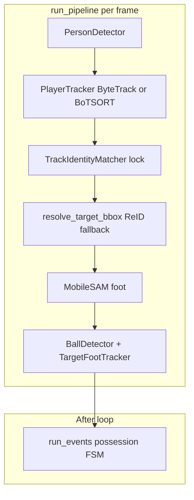

# Soccer Tracking Pipeline Fix v2 (Refined)

## Problem statement

On `testmatch2` (H. Lozano), ball detection works but **Pass/Shot/Goal/Drive stay zero** because the target foot and ball are never within possession range. Debug showed `min_px_dist` stuck ~237px and `min_m_dist` ~19m: the target anchor drifts to **non-player regions** (scoreboard/grass) via [`resolve_target_bbox`](backend/app/pipeline/segmentation.py), especially when ByteTrack loses `lock.track_id`. Broadcast **scene cuts** invalidate homography and keep a stale **permanent lock** ([`TrackIdentityMatcher`](backend/app/pipeline/matcher.py) — no `release_lock` today).



**Not in scope:** detector swap, `IdentifyEngine` / `detetction_test` identity redesign, jersey tracklet merge offline pass, `boxmot` migration.

---

## Implementation order

| Phase | Goal | Blocks events? |
|-------|------|----------------|
| **0** | Spike + shared bbox helpers | No |
| **1** | Validity gate on ReID fallback (**blocking**) | Yes |
| **2** | Scene cuts + reset + relock (**co-primary for highlights**) | Yes |
| **3** | Possession prefers metres + on-pitch gate | Yes |
| **4** | BoT-SORT + `track_buffer=120` | Stability |
| **5** | Validation on `testmatch2` | Verify |
| **6** | Docs / env defaults | Polish |

Phases **1 and 2** can be developed in parallel after Phase 0; **3** depends on calibration being present; **4** is independent but test after 1–2.

---

## Phase 0 — Prep and shared utilities

### 0.1 BoT-SORT feasibility spike (30 min, de-risk Phase 4)

In a throwaway script or REPL (not committed), with project venv:

- Import `BYTETracker` / check Ultralytics 8.3 for `tracker_type="botsort"` and ReID args (`with_reid`, `model` or weights path).
- Confirm whether **opencv-python-headless** supports ECC GMC or if `sparseOptFlow` / `orb` is required on MPS.
- Document result in a short comment in [`backend/app/pipeline/tracker.py`](backend/app/pipeline/tracker.py) module docstring or Phase 4 PR notes.

**Done when:** Known whether Phase 4 is `tracker_type` swap only or needs contrib / custom ReID hook.

### 0.2 Port person bbox validation to backend

- Move or re-export [`detetction_test/bbox_utils.is_valid_person_bbox`](detetction_test/bbox_utils.py) into [`backend/app/pipeline/bbox.py`](backend/app/pipeline/bbox.py) (copy logic, keep env tunables: `BBOX_MIN_SIZE`, `BBOX_MIN_ASPECT`, `BBOX_MAX_*`).
- Keep [`is_valid_bbox`](backend/app/pipeline/bbox.py) for minimal size checks (OCR path).
- Add unit tests in `backend/tests/test_bbox.py` (new): reject wide box `w > h`, accept typical player aspect.

### 0.3 Optional cleanup (diagnostic only)

- Leave [`_ball_debug_dir` / `_save_ball_debug`](backend/app/pipeline/run.py) gated by `BALL_DEBUG_DIR` (already opt-in). No removal unless you want a smaller diff.

---

## Phase 1 — ReID fallback validity gate (Fix #1, blocking)

**File:** [`backend/app/pipeline/segmentation.py`](backend/app/pipeline/segmentation.py)

### 1.1 Add `is_valid_reid_candidate_bbox`

New module-level helper (not a class method):

```python
def is_valid_reid_candidate_bbox(
    bbox: list[float],
    frame_shape: tuple[int, ...],
    *,
    calibration: PitchCalibration | None = None,
) -> bool:
```

Logic (in order):

1. `is_valid_person_bbox(bbox, frame_shape)` from [`bbox.py`](backend/app/pipeline/bbox.py).
2. If `calibration` provided: foot center = bbox bottom-center → `calibration.pixel_to_meters` → reject unless [`is_on_pitch`](backend/app/pipeline/pitch_homography.py) (reuse heatmap convention).
3. **Do not** add HSV grass mask (fragile on broadcast).

### 1.2 Filter candidates in `resolve_target_bbox`

In the loop over `tracks` (lines 419–425):

- Skip tracks failing `is_valid_reid_candidate_bbox` before embedding/scoring.
- If `lock_track_id in by_id`, still validate bbox with same helper; if invalid, **do not** return that bbox (fall through to ReID or `None`).
- Keep existing thresholds: `reid_fallback_thresh` (default **0.65**), margin, `reid_fallback_max_center_frac` — **do not** lower to 0.45.

### 1.3 Thread `calibration` into call sites

Update signature:

```python
def resolve_target_bbox(..., calibration: PitchCalibration | None = None, ...)
```

Pass `calibration` from all callers in [`run.py`](backend/app/pipeline/run.py) (~lines 262, 566, 586, 696) and [`_foot_from_locked_bbox`](backend/app/pipeline/run.py).

### 1.4 Tests

- `backend/tests/test_resolve_target_bbox.py` (new):
  - Mock tracks: one wide scoreboard-like box (high ReID sim), one narrow player box (lower sim) → must pick player.
  - Off-pitch projected center → rejected when calibration fixture used ([`build_calibration`](backend/app/pipeline/pitch_homography.py) from existing tests).

### 1.5 Manual verify (Fix #1)

- `MAX_FRAMES=1500`, MPS outside sandbox, `BALL_DEBUG_DIR` set, analyze `testmatch2`.
- Expect: annotated frames show TARGET on player; summary log `min_m_dist` **below ~5m** on at least one tactical segment (not necessarily whole video).

---

## Phase 2 — Scene cut detector + state reset (Fix #4)

**New file:** [`backend/app/pipeline/scene_cut.py`](backend/app/pipeline/scene_cut.py)

### 2.1 Implement `SceneCutDetector`

- `update(frame) -> bool` (cut detected this frame).
- Gray 64-bin hist + `cv2.HISTCMP_CORREL`; default `threshold=0.65`.
- `is_suppressed` property: true for `suppress_frames` after cut (default **45** @ 30fps ≈ 1.5s).
- Env: `SCENE_CUT_THRESH`, `SCENE_CUT_SUPPRESS_FRAMES`.

### 2.2 `PlayerTracker.reset()`

In [`backend/app/pipeline/tracker.py`](backend/app/pipeline/tracker.py):

- Re-instantiate `BYTETracker` / BoT-SORT internal state (same args as `__init__`).
- Do **not** reference `model.predictor` (not used in this wrapper).

### 2.3 `TrackIdentityMatcher.release_lock()`

In [`backend/app/pipeline/matcher.py`](backend/app/pipeline/matcher.py):

```python
def release_lock(self) -> None:
    self.lock = None
    # Keep reid_prototype and vote dicts for faster re-acquire on new shot
```

Optional env `SCENE_CUT_CLEAR_VOTES=1` to clear votes if relock picks wrong track repeatedly.

### 2.4 Wire into [`run.py`](backend/app/pipeline/run.py) loop

Before `detector(frame)` / after read frame:

```python
is_cut = scene_detector.update(frame)
if is_cut:
    tracker.reset()
    matcher.release_lock()
    locked_at_frame = None
    last_seg_bbox = None
    last_anchor_foot_px = None
    seg_state = SegmentationState()  # new instance or explicit reset method
    if ball_detector: ball_detector.reset()
    if target_tracker: target_tracker.reset()
    # log frame_idx

skip_ball = scene_detector.is_suppressed  # or is_cut
```

When `skip_ball`:

- Skip block: `ball_detector.detect`, `ball_states.append`, `target_tracker.observe`, `_save_ball_debug`.
- **Still run:** detection, tracking, OCR, `try_acquire_lock` (enables relock after cut).

On **new lock** after release: set `locked_at_frame = frame_idx` (same as existing lock path).

### 2.5 Multi-segment `locked_at_frame` for `run_events`

Today [`run_events`](backend/app/pipeline/ball_events/run_events.py) uses single `locked_at_frame`. After relock:

- **v1 approach:** Pass **latest** `locked_at_frame` only; ball_states/target_samples from earlier epoch with wrong target are still in lists.
- **v1.1 (recommended micro-task):** Add `lock_epoch_start: int` updated on each `release_lock` + lock; filter timeline in `run_events` to `frame >= lock_epoch_start` OR clear `ball_states` / `target_samples` on cut (simpler: **clear lists on cut**).

Micro-task **2.5b:** On cut, `ball_states.clear(); target_samples.clear()` to avoid cross-shot contamination.

### 2.6 Tests

- `backend/tests/test_scene_cut.py`: synthetic frame pair (black vs white) triggers cut; suppress window counts down.

### 2.7 Manual verify (Fix #2)

- Log cut frame indices; confirm no possession FSM activity in suppress window on known replay segment.
- Confirm relock occurs (new `target.method` / `locked_at_frame` after tactical shot returns).

---

## Phase 3 — Possession distance in pitch metres (Fix #3)

**File:** [`backend/app/pipeline/ball_events/possession.py`](backend/app/pipeline/ball_events/possession.py)

### 3.1 Change `_proximity` preference

Current (wrong for calibrated tactical view):

```73:85:backend/app/pipeline/ball_events/possession.py
        if target.target_px is not None and ball.cx_px > 0:
            return dist_px(...), "px"
        if ball.smooth_m is not None and target.target_m is not None:
            return dist_m(...), "m"
```

**New order:**

1. If `ball.smooth_m` and `target.target_m` both set → `dist_m`, `"m"`.
2. Else if px available → `dist_px`, `"px"`.
3. Else `None`.

Add optional `calibration_valid: bool` on `PossessionTracker.update` or pass via `FrameTimeline` meta — **minimal v1:** only reorder; gate off-pitch in 3.2.

### 3.2 On-pitch gate before `_close`

If using metres: require `is_on_pitch` for both ball `smooth_m` and `target.target_m` (import from `pitch_homography`). If either off-pitch → treat as not close (forces `NO_BALL` / no sticky gap).

Env: `POSSESS_REQUIRE_ON_PITCH=1` (default on when calibration used).

### 3.3 Update tests

- [`backend/tests/test_ball_possession.py`](backend/tests/test_ball_possession.py): add case where px distance is small but `target_m` far → must **not** possess when metres path used.
- Adjust existing tests if they relied on px-first with mismatched m/px coords.

### 3.4 Manual verify

- After Phases 1–2: `possessed_frames > 0` in debug summary; event counts non-zero on tactical segment with known touch.

---

## Phase 4 — ByteTrack → BoT-SORT (Fix #2)

**Files:** [`backend/app/pipeline/tracker.py`](backend/app/pipeline/tracker.py), [`detetction_test/tracker.py`](detetction_test/tracker.py)

### 4.1 Env-driven tracker type

Extend `PlayerTracker.__init__`:

- `TRACKER_TYPE` env: `bytetrack` (default) | `botsort`.
- `TRACK_BUFFER` default **120** when `botsort` (keep **30** for bytetrack unless env set).
- Map Ultralytics args: `track_high_thresh`, `track_low_thresh`, `new_track_thresh`, `match_thresh`, `fuse_score=False` (unchanged).

### 4.2 BoT-SORT-specific args (from spike 0.1)

If supported on `IterableSimpleNamespace`:

- `cmc_method`: `sparseOptFlow` on MPS/CPU, `ecc` only if contrib verified.
- `with_reid: True` + path to [`resolve_reid_weights_path`](backend/app/pipeline/reid.py) / `REID_WEIGHTS`.

If Ultralytics cannot load custom OSNet: keep `botsort` **without** embedded ReID; rely on Phase 1 gate + longer buffer only.

### 4.3 Mirror in `detetction_test/tracker.py`

Same env names for sandbox parity.

### 4.4 README / weights

Update [`backend/README.md`](backend/README.md) and [`backend/weights/README.md`](backend/weights/README.md): `TRACKER_TYPE`, `TRACK_BUFFER`, GMC note.

### 4.5 Manual verify

- Counter in debug log: `resolve_target_bbox` ReID fallback rate per 1000 frames ↓ vs ByteTrack baseline on same `MAX_FRAMES` cap.

---

## Phase 5 — End-to-end validation

### 5.1 Automated

```bash
cd backend && pytest tests/test_bbox.py tests/test_resolve_target_bbox.py tests/test_scene_cut.py tests/test_ball_possession.py -q
```

### 5.2 `testmatch2` checklist (H. Lozano #23)

| Check | Pass criterion |
|-------|----------------|
| Fix #1 | Debug frames: TARGET bbox on player, not HUD |
| Fix #2 | Cuts logged; no events in suppress window on replay |
| Fix #3 | `min_m_dist` < 2.5m on at least one frame post-lock |
| Events | `event_counts` Pass or Drive > 0 on capped tactical run (optional: full video overnight) |
| Regression | Heatmap / movement stats still return for locked player |

### 5.3 Env profile (fast iteration)

```bash
export MAX_FRAMES=1500
export TRACKER_TYPE=botsort
export TRACK_BUFFER=120
export REID_FALLBACK_MAX_CENTER_FRAC=0.12
export REID_FALLBACK_THRESH=0.65
# MPS: run uvicorn outside sandbox
```

---

## Phase 6 — Documentation and diagnostics

### 6.1 Extend `_log_event_summary` in [`run_events.py`](backend/app/pipeline/ball_events/run_events.py)

Add fields: `reid_fallback_frames`, `scene_cuts`, `frames_suppressed`, `proximity_units_m_count` vs `px_count`.

### 6.2 Remove hardcoded debug path

Replace absolute path `.cursor/debug-6b7c41.log` with env `BALL_EVENTS_SUMMARY_LOG` or repo-relative default under `.cursor/`.

---

## Risk register

| Risk | Mitigation |
|------|------------|
| BoT-SORT ReID incompatible with OSNet weights | Phase 0 spike; fallback buffer-only botsort |
| `release_lock` causes no lock on short suppress | Keep votes; lower suppress on clean tactical-only videos |
| Clearing ball_states on cut loses pre-cut events | Acceptable for highlights; tactical runs relock quickly |
| ECC slow on CPU | `sparseOptFlow` default on non-CUDA |

---

## Files touched (summary)

| File | Action |
|------|--------|
| [`backend/app/pipeline/bbox.py`](backend/app/pipeline/bbox.py) | Add `is_valid_person_bbox` |
| [`backend/app/pipeline/segmentation.py`](backend/app/pipeline/segmentation.py) | Gate `resolve_target_bbox` |
| [`backend/app/pipeline/scene_cut.py`](backend/app/pipeline/scene_cut.py) | **New** |
| [`backend/app/pipeline/matcher.py`](backend/app/pipeline/matcher.py) | `release_lock()` |
| [`backend/app/pipeline/tracker.py`](backend/app/pipeline/tracker.py) | `reset()`, BoT-SORT env |
| [`backend/app/pipeline/run.py`](backend/app/pipeline/run.py) | Scene detector, skip_ball, clears on cut |
| [`backend/app/pipeline/ball_events/possession.py`](backend/app/pipeline/ball_events/possession.py) | Metres-first + on-pitch |
| [`detetction_test/tracker.py`](detetction_test/tracker.py) | Mirror tracker env |
| `backend/tests/test_*.py` | New/updated tests |
| [`backend/README.md`](backend/README.md) | Env docs |
