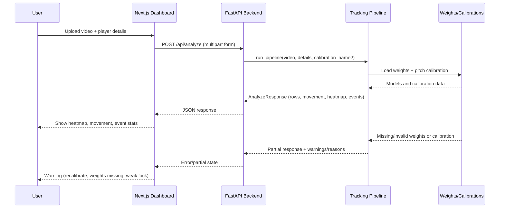

# Player Analysis

## 1) Overview

This system lets a user upload a football video, pick a player (jersey number + colors), and get that player's movement and event summary back in one response.  
It exists to turn raw match footage into usable player-tracking insights without a manual labeling workflow for every clip.  
It solves the practical problem of combining player lock, pitch mapping, and visual output (heatmap + metrics) in one flow.

## 2) Architecture Diagram



## 3) How It Works

1. User uploads a video and enters player details in the dashboard.  
2. Frontend calls health to check backend readiness (`/health`).  
3. Optional: user calibrates pitch (preview first, then save) so pixel positions can map to metres (this is required for metre-based stats).  
4. Frontend submits `POST /api/analyze` with video, details JSON, and optional calibration key.  
5. Backend validates input and streams the video to a temp file (prevents loading huge files into memory).  
6. Pipeline detects/tracks players, tries to lock onto the target player, then tracks the lock through the clip.  
7. If calibration is valid, backend maps player foot positions onto pitch coordinates to compute movement and heatmap.  
8. If ball weights + calibration + usable lock epochs exist, backend infers Pass/Shot/Goal/Drive events.  
9. Frontend renders response and warnings (for example: weak lock, no ball weights, bad calibration fit).

## 4) Parameters / Inputs

| Name | Type | Required | Default | What it does |
|---|---|---:|---|---|
| `video` | Upload file (`.mp4` / `.mov`) | Yes | none | Source clip for analysis. Empty upload fails. |
| `details` | JSON string (`PlayerDetails`) | Yes | none | Target player info (`jerseyNumber` must be 1-99). |
| `calibration_name` | string (safe chars only) | No | `null` | Picks saved pitch calibration for this analyze call. Invalid format returns 400. |
| `name` (calibration APIs) | string | Yes | `testmatch2` | Key used to save/load pitch calibration artifacts. |
| `frame_index` | integer | Yes | `100` | Video frame used to calibrate. |
| `image_boundary_points` | `number[][]` | Yes (for new flow) | none | 4-20 outline points used to compute homography. |
| `image_width` / `image_height` | integer pair | Optional | none | Used by calibration preview when validating uploaded video frames client-side. |
| `NEXT_PUBLIC_API_URL` | env var | No | `http://localhost:8000` | Frontend API base URL. |
| `JERSEY_WEIGHTS`, `SAM_WEIGHTS`, `BALL_WEIGHTS`, `REID_WEIGHTS` | env vars / file paths | Optional but recommended | project defaults | Improve lock quality, segmentation, and ball events. |

## 5) Step-by-Step Execution Guide

### Prerequisites

- Node.js + npm (for Next.js frontend)
- Python 3.10+ (backend)
- Optional model checkpoints in `backend/weights/` for best results

### Installation

```bash
# 1) Install frontend deps
npm install

# 2) Setup backend venv + deps
cd backend
python3 -m venv .venv
source .venv/bin/activate
pip install -r requirements.txt
cd ..
```

### Development run

```bash
# Terminal A: backend
source backend/.venv/bin/activate
uvicorn backend.app.main:app --reload --port 8000

# Terminal B: frontend
cp .env.local.example .env.local
npm run dev
```

Open:

- Frontend: `http://localhost:3000`
- Backend health: `http://localhost:8000/health`

### Production-style run (local smoke)

```bash
npm run build
npm run start
```

```bash
source backend/.venv/bin/activate
uvicorn backend.app.main:app --host 0.0.0.0 --port 8000
```

### Run tests

```bash
source backend/.venv/bin/activate
python -m pytest backend/tests -q
```

```bash
npm run lint
```

### Verify it works

1. `/health` returns `status: ok` and a `mobile_sam` block.
2. Upload a video in the dashboard.
3. Calibrate pitch (Validate & preview, then Save).
4. Click Analyze.
5. Expect: metrics panel + heatmap; if something is missing, a specific warning is shown.

### Model weights

Place checkpoints in `backend/weights/` (gitignored). Verify with:

```bash
bash backend/scripts/check_weights.sh
```

| File | Purpose |
|------|---------|
| `mobile_sam.pt` | Player segmentation masks |
| `jersey_number_b0.pt` | Jersey digit classifier |
| `osnet_x1_0_soccernet.pth` | ReID appearance lock |
| `yolov8n_ball.pt` | Football ball events |
| `yolov8m_shuttlecock.pt` | Badminton rally stats |

## 6) Common Errors

- `Invalid calibration name. Use letters, digits, underscore, or hyphen only.` -> `calibration_name` format is invalid -> Send safe key only (example: `match1_half1`).
- `Uploaded video file is empty` -> Upload stream had 0 bytes -> Re-export/re-upload the clip.
- `Not enough disk space to save calibration` -> Disk full during calibration upload -> Free disk and retry.
- `Ball event stats unavailable: add yolov8n_ball.pt` -> Ball weights missing or not loadable -> Place/correct `yolov8n_ball.pt`.
- Heatmap warning about calibration mismatch/out-of-bounds -> Saved calibration does not fit this video framing -> Recalibrate on the same camera view/size.

## 7) What This Does Not Do

- It does not provide broadcast-grade event labeling; ball events are inferred heuristics.
- It does not auto-select the best calibration by upload filename unless frontend passes `calibration_name`.
- It does not guarantee accurate metres when lock quality is weak (`color` lock or fallback track).
- It does not commit or distribute large model checkpoints through git.
- It does not replace manual QA for unusual camera angles, severe occlusion, or low-resolution clips.

## 8) Edge Cases and How to Handle Them

| Situation | What goes wrong | How to fix it |
|---|---|---|
| Empty upload file | Analyze fails with 422 | Verify file integrity and re-upload. |
| Invalid `details` JSON | API rejects request | Ensure `details` is valid JSON and `jerseyNumber` is 1-99. |
| Invalid `calibration_name` format | API returns 400 | Use only letters, digits, `_`, `-`. |
| No calibration or bad calibration fit | Metre movement/heatmap may be null or wrong | Run calibration preview and save again on a wide, clear pitch frame. |
| Missing `mobile_sam.pt` | Segmentation health degraded; bbox fallback used | Add `backend/weights/mobile_sam.pt` or disable SAM intentionally. |
| Missing jersey/ReID weights | Lock quality drops, more weak/approximate warnings | Add `jersey_number_b0.pt` and OSNet weights under `backend/weights/`. |
| Missing ball weights | Event counts unavailable (`no_ball_weights`) | Add `yolov8n_ball.pt` to `backend/weights/` or set `BALL_WEIGHTS`. |
| Slow analyze on long clips | High latency and delayed response | Reduce clip length or lower `MAX_FRAMES`; use GPU-backed env where available. |
| Concurrent quick file changes in UI | Calibration-ready status can desync if stale requests win | Keep latest code with request-version guard in `UploadAnalyzePanel`. |
| Very large upload | Request rejected due to size cap | Increase `MAX_UPLOAD_MB` intentionally or upload a smaller clip. |
