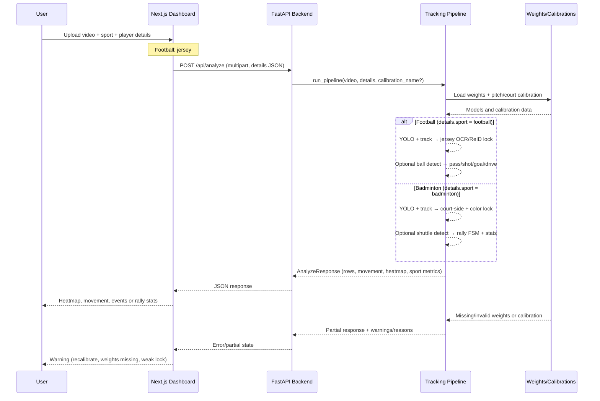

# Player Analysis

## 1) Overview

This system lets a user upload a **football** or **badminton** match video, identify a target player, and get movement and sport-specific stats back in one response.

- **Football:** pick jersey number + kit colors → heatmap, distance/speed, and inferred pass/shot/goal/drive events.
- **Badminton:** pick court side (near/far) + shirt color → heatmap, distance/speed, and rally stats (wins, duration, serve/return points) when shuttle weights are present.

It exists to turn raw match footage into usable player-tracking insights without a manual per-frame labeling workflow. The same dashboard, API, and tracking pipeline handle both sports; behavior branches on `details.sport`.

## 2) Architecture Diagram



## 3) How It Works

### Shared flow (both sports)

1. User selects **Football** or **Badminton** in the dashboard and uploads a video.
2. Frontend calls `/health` to check backend readiness (SAM, shuttle weights, Ollama).
3. User calibrates the playing surface (preview first, then save). Required for metre-based movement and heatmap.
4. Frontend submits `POST /api/analyze` with video, `details` JSON, and optional `calibration_name`.
5. Backend validates input and streams the video to a temp file.
6. Pipeline runs YOLO person detection + multi-object tracking on every frame.
7. Pipeline locks onto the target player and tracks them through the clip.
8. If calibration is valid, foot positions map to court/pitch coordinates → movement stats + heatmap.
9. Frontend renders metrics, heatmap, warnings, and optional annotated video.

### Football-specific

- **Player lock:** jersey number (EfficientNet classifier + EasyOCR fallback), optional name, kit colors, optional ReID (`osnet_x1_0_soccernet.pth`).
- **Calibration:** full pitch template (105 m × 68 m default).
- **Extra metrics:** inferred ball events (pass, shot, goal, drive) when `yolov8n_ball.pt` is present and lock quality is sufficient.
- **Segmentation:** MobileSAM masks enabled by default (`SAM_ENABLED=1`).

### Badminton-specific

- **Player lock:** court side (`near` / `far`) disambiguates which singles player to track; shirt color (HSV) as fallback when both players are visible.
- **Calibration:** singles court template (13.4 m × 6.1 m). Save calibration while Badminton is selected so dimensions match.
- **Extra metrics:** rally stats (`total_rallies`, `avg_rally_duration_s`, serve/return wins, etc.) when `yolov8m_shuttlecock.pt` is present.
- **Segmentation:** MobileSAM **off by default** for badminton (`SAM_ENABLED=0`); set `SAM_ENABLED=1` to enable masks.
- **Skipped:** jersey OCR and football ball-event pipeline do not run for badminton.

## 4) Parameters / Inputs

### API / upload

| Name | Type | Required | Default | What it does |
|---|---|---:|---|---|
| `video` | Upload file (`.mp4` / `.mov`) | Yes | none | Source clip for analysis. Empty upload fails. |
| `details` | JSON string (`PlayerDetails`) | Yes | none | Sport + target player info (see below). |
| `calibration_name` | string (safe chars only) | No | `null` | Saved pitch/court calibration key for this analyze call. |
| `name` (calibration APIs) | string | Yes | `testmatch2` | Key used to save/load calibration artifacts. |
| `frame_index` | integer | Yes | `100` | Video frame used to calibrate. |
| `image_boundary_points` | `number[][]` | Yes (new flow) | none | 4–20 outline points for homography. |
| `image_width` / `image_height` | integer pair | Optional | none | Client-side calibration preview validation. |
| `NEXT_PUBLIC_API_URL` | env var | No | `http://localhost:8000` | Frontend API base URL. |

### `PlayerDetails` — football

| Field | Required | Notes |
|---|---|---|
| `sport` | Yes | `"football"` |
| `jerseyNumber` | Yes | 1–99 |
| `name` | No | Helps number+name lock |
| `primaryJerseyColor` / `secondaryJerseyColor` | Recommended | Hex colors (`#rrggbb`) |
| `teamName` | No | Display + insights |

### `PlayerDetails` — badminton

| Field | Required | Notes |
|---|---|---|
| `sport` | Yes | `"badminton"` |
| `courtSide` | Yes | `"near"` or `"far"` (camera-relative) |
| `primaryJerseyColor` | Yes | Shirt color for disambiguation |
| `secondaryJerseyColor` | No | Trim color |
| `name` / `teamName` | No | Display + insights |
| `jerseyNumber` | No | Not used for badminton lock |

### Model weights (env overrides)

| Variable | Default path | Sport | Purpose |
|---|---|---|---|
| `JERSEY_WEIGHTS` | `backend/weights/jersey_number_b0.pt` | Football | Jersey digit classifier |
| `REID_WEIGHTS` | `backend/weights/osnet_x1_0_soccernet.pth` | Football | Appearance lock |
| `BALL_WEIGHTS` | `backend/weights/yolov8n_ball.pt` | Football | Ball events |
| `SHUTTLE_WEIGHTS` | `backend/weights/yolov8m_shuttlecock.pt` | Badminton | Rally detection |
| `SAM_WEIGHTS` | `backend/weights/mobile_sam.pt` | Both | Player masks (off by default for badminton) |
| `SAM_ENABLED` | `1` (football), `0` (badminton) | Both | Toggle segmentation |

## 5) Step-by-Step Execution Guide

### Prerequisites

- Node.js + npm (Next.js frontend)
- Python 3.10+ (backend)
- Model checkpoints in `backend/weights/` for full features (see table below)

### Installation

```bash
# 1) Install frontend deps
npm install

# 2) Setup backend venv + deps
cd backend
python3 -m venv .venv
source .venv/bin/activate
pip install -r requirements.txt
cd ..
```

### Development run

```bash
# Terminal A: backend
source backend/.venv/bin/activate
uvicorn backend.app.main:app --reload --port 8000
# or: ./scripts/dev_backend.sh  (MPS + BoT-SORT tuned defaults)

# Terminal B: frontend
cp .env.local.example .env.local
npm run dev
```

Open:

- Frontend: `http://localhost:3000`
- Backend health: `http://localhost:8000/health`

### Production-style run (local smoke)

```bash
npm run build
npm run start
```

```bash
source backend/.venv/bin/activate
uvicorn backend.app.main:app --host 0.0.0.0 --port 8000
```

### Run tests

```bash
source backend/.venv/bin/activate
python -m pytest backend/tests -q
```

```bash
npm run lint
npx playwright test   # dashboard layout; full analyze needs backend + test video
```

### Verify it works

**Football**

1. `/health` → `mobile_sam.status: ok` (if weights installed).
2. Select **Football**, upload video, enter jersey number + kit colors.
3. Calibrate pitch (Validate & preview → Save).
4. Click **Analyze**.
5. Expect: movement stats, heatmap, optional event counts.

**Badminton**

1. `/health` → `shuttle.status: ok` (if `yolov8m_shuttlecock.pt` installed).
2. Select **Badminton**, upload video, pick **Near court** or **Far court** + shirt color.
3. Calibrate singles court while Badminton is selected (13.4 m × 6.1 m).
4. Click **Analyze**.
5. Expect: movement stats, heatmap, rally stats (or `badminton_stats_unavailable_reason` if shuttle weights missing).

### Model weights

Place checkpoints in `backend/weights/` (gitignored). Verify with:

```bash
bash backend/scripts/check_weights.sh
```

| File | Sport | Purpose |
|------|-------|---------|
| `mobile_sam.pt` | Both | Player segmentation masks |
| `jersey_number_b0.pt` | Football | Jersey digit classifier |
| `osnet_x1_0_soccernet.pth` | Football | ReID appearance lock |
| `yolov8n_ball.pt` | Football | Ball detection → pass/shot/goal/drive |
| `yolov8m_shuttlecock.pt` | Badminton | Shuttle detection → rally stats |

## 6) Common Errors

**Both sports**

- `Invalid calibration name...` → use only letters, digits, `_`, `-`.
- `Uploaded video file is empty` → re-export and re-upload.
- Heatmap warning (calibration mismatch / out-of-bounds) → recalibrate on the same camera view and resolution.

**Football**

- `Ball event stats unavailable: add yolov8n_ball.pt` → place weights in `backend/weights/` or set `BALL_WEIGHTS`.
- Weak lock warnings → add `jersey_number_b0.pt` and/or `osnet_x1_0_soccernet.pth`.

**Badminton**

- `courtSide is required for badminton` → select Near court or Far court before analyze.
- `primaryJerseyColor is required for badminton` → pick a shirt color.
- `court_dimension_mismatch` → saved calibration is football-sized; recalibrate with Badminton selected.
- Rally stats null + `no_shuttle_weights` → add `yolov8m_shuttlecock.pt`.

## 7) What This Does Not Do

- It does not provide broadcast-grade event labeling; football ball events and badminton rally stats are inferred heuristics.
- It does not auto-select calibration by upload filename unless the frontend passes `calibration_name`.
- It does not guarantee accurate metres when lock quality is weak (color-only lock or fallback track).
- It does not commit or distribute large model checkpoints through git.
- Badminton singles MVP assumes one player per court side when both are visible; doubles / heavy occlusion are not fully supported.
- It does not replace manual QA for unusual camera angles, severe occlusion, or low-resolution clips.

## 8) Edge Cases and How to Handle Them

| Situation | What goes wrong | How to fix it |
|---|---|---|
| Empty upload file | Analyze fails with 422 | Verify file integrity and re-upload. |
| Invalid `details` JSON | API rejects request | Ensure valid JSON and sport-specific required fields. |
| Football: `jerseyNumber` missing/0 | Validation error | Set jersey 1–99. |
| Badminton: missing `courtSide` | Validation error | Set `near` or `far`. |
| Badminton: wrong calibration dimensions | `court_dimension_mismatch` | Recalibrate with Badminton sport selected (13.4 × 6.1 m). |
| No calibration or bad fit | Metre stats / heatmap null or wrong | Preview calibration on a clear full-court frame, then save. |
| Missing `mobile_sam.pt` | Bbox-only tracking; masks unavailable | Add weight or set `SAM_ENABLED=0` intentionally. |
| Missing jersey/ReID weights (football) | Weaker number lock | Add `jersey_number_b0.pt` / `osnet_x1_0_soccernet.pth`. |
| Missing ball weights (football) | `event_counts: null` | Add `yolov8n_ball.pt` or set `BALL_WEIGHTS`. |
| Missing shuttle weights (badminton) | `badminton_stats: null` | Add `yolov8m_shuttlecock.pt` or set `SHUTTLE_WEIGHTS`. |
| Slow analyze on long clips | High latency | Shorten clip or lower `MAX_FRAMES`; use GPU/MPS env vars. |
| Very large upload | 413 rejected | Lower file size or raise `MAX_UPLOAD_MB`. |
